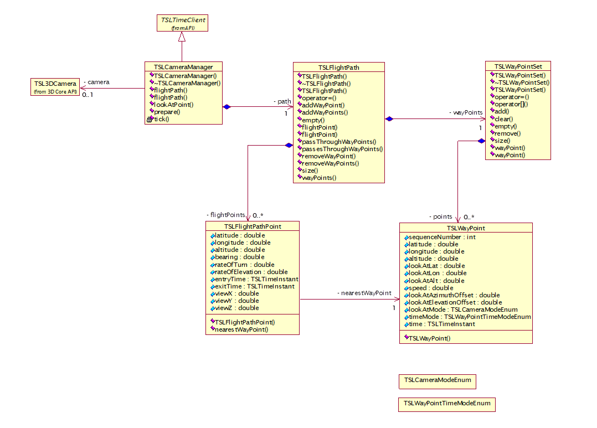

---
title: "MapLink Camera Manager"
---

# MapLink Camera Manager

The Camera Manager is a new component which allows users to
automatically fly the 3D camera. This is done by defining the flight
path of the camera based on a set of waypoints. The Camera Manager
calculates a flight path using a spline interpolation based on the
waypoints. The waypoints also define a time at which the camera will
pass through each position. Since the Camera Manager is a TSLTimeClient,
it can then be driven automatically along the flight path.

## Library Usage and Configuration

As with the MapLink Core SDK, the MapLink Camera Manager comes in 2
different flavours. It should be noted that the library to be linked
with should be determined by the Core SDK library that you are using
within your application. For example, if you are using the Release mode,
DLL version of the Core SDK (MapLink.lib) then you must use the
equivalent Camera Manager library (MapLinkCameraManager.lib/
MapLinkCameraManager64.lib). The Camera Manager is dependent on the
MapLink 3D SDK. The table below describes the preprocessor directives
and link options that should be set in the Project Properties for using
the MapLink Camera Manager. For X11 targets, refer to the product
Release Notes.

+----------------------------------+-----------------------------------+
| **MapLinkCameraManager.lib or    | **MapLinkCameraManagerd.lib or    |
| MapLinkCameraManager64.lib**     | MapLinkCameraManager64d.lib**     |
|                                  |                                   |
| Release mode, DLL version.       | Debug mode, DLL version.          |
|                                  |                                   |
| Uses Multithreaded DLL C++       | Uses Debug Multithreaded DLL C++  |
| run-time library.                | run-time library.                 |
|                                  |                                   |
| Requires TTLDLL preprocessor     | Requires TTLDLL preprocessor      |
| directive.                       | directive.                        |
|                                  |                                   |
| Refer to the document \"MapLink  | No redistributable run-time       |
| Pro X.Y: Deployment of End User  | available.                        |
| Applications\" for a list of     |                                   |
| run-time dependencies when       | **KEYED: Development machines     |
| redistributing.                  | only.**                           |
|                                  |                                   |
| Where X.Y is the version of      |                                   |
| MapLink you are deploying.       |                                   |
+----------------------------------+-----------------------------------+

## MapLink Camera Manager Classes

### TSLCameraManager

This class is responsible for controlling the 3D camera and its motion
along a pre-defined path. It is a client of TSLTimeServer and can
therefore be controlled by the MapLink Time SDK.

Users can access the flight path through the method flightPath which
returns a reference to the flight path object. The path can then be
defined by passing it a set of waypoints. Spline interpolation is used
to create the actual path based on the supplied waypoints.

### TSLFlightPath

The class represents a path through 3D space. It takes the user-defined
set of waypoints and creates a smooth interpolated path. By default, the
path will pass through each waypoint. An alternative is for the path to
treat the waypoints as control points and provide a smooth interpolation
without necessarily going through each way point. To achieve this, call
the method passThroughWayPoints passing in false.

### TSLFlightPoint

This class represents a point on the actual interpolated path which is
created based on the user-defined waypoints. It contains the following
public attributes:

- latitude, longitude, altitude: The position of the flight point
  (degrees, metres).

- bearing: The heading of the camera at the flight point (degrees).

- rateOfTurn: A measure of how quickly the path is changing direction at
  this flight point (degrees/second).

- rateOfElevation: A measure of how quickly the path is changing
  altitude at this flight point (metres/second).

- entryTime, exitTime: The times at which the camera enters and leaves
  the segment between this flight point and the next. The difference
  between these times is the transit time of the segment from the flight
  point to the next.

- viewX, viewY, viewZ: The components of the camera's view vector.

### TSLWayPoint

This class encapsulates a waypoint. Clients define a flight path by
specifying a set of waypoints. The actual flight path is created by
using spline interpolation based on these waypoints.

TSLWayPoint contains the following public attributes:

- sequenceNumber: This defines the position of the waypoint in the
  waypoint collection (TSLWayPointSet).

- latitude, longitude, altitude: The position of the waypoint (degrees,
  metres).

- lookAtLat, lookAtLon, lookAtAlt: The look-at position of the camera at
  this point (degrees, metres).

- speed: The speed of the camera through this waypoint (metres/second).

- lookAtAzimuthOffset: This specifies the (horizontal) offset (degrees)
  of the view vector - it is only used if the value of lookAtMode has
  been set to TSLCameraModeLookAtRelative.

- lookAtElevationOffset: This specifies the (vertical) offset (degrees)
  of the view vector - it is only used if the value of lookAtMode has
  been set to TSLCameraModeLookAtRelative.

- lookAtMode: This specifies how the camera view vector is to be
  orientated. The possible values are:

- TSLCameraModeLookAtFixed: The camera is to look at a fixed position.

- TSLCameraModeLookAtRelative: The camera is to look at a point relative
  to its current position.

- timeMode: This specifies whether the time is calculated from the
  speeds at the waypoints. The possible values are:

- TSLWayPointTimeModeAbsolute: The time at each waypoint is explicitly
  defined.

- TSLWayPointTimeModeLegSpeed: The time at each waypoint is deduced from
  the speed at the previous waypoint. The time in this case is based on
  the time defined at the first waypoint.

- time: The time of arrival at the waypoint.

### TSLWayPointSet

This class encapsulates a collection of TSLWayPoint objects.

## Sample Usage

The following code snippets show how the Camera Manager might be used in
an MFC application. All details except for those directly related to the
Camera Manager are omitted. Please refer to Section [18.2](#api-usage)
for 3D-specific details.

> class CMovieDoc : public CDocument
>
> {
>
> public:
>
> \...
>
> void addToTimeServer(TSLTimeClient\* client);
>
> void startTimeServer(TSLTimeInstant const& t0,
>
> TSLTimerListener\* listener);
>
> void startTimeServer();
>
> void stopTimeServer();
>
> void pauseTimeServer();
>
> private:
>
> \...
>
> TSLTimeServer m_timeServer;
>
> };
>
> void CMovieDoc::addToTimeServer(TSLTimeClient\* client)
>
> {
>
> client-\>attachToServer( &m_timeServer );
>
> }
>
> void CMovieDoc::startTimeServer(TSLTimeInstant const& t0,
>
> TSLTimerListener\* listener)
>
> {
>
> TSLTimer& timer = m_timeServer.timer();
>
> TSLTimeHelper const& timeHelper = timer.timeHelper();
>
> timer.stop();
>
> static const double tickRate = 30.0; // frames/second
>
> static const double timeFrame = 15.0; // minutes
>
> timer.tickInterval( timeHelper.hertz( tickRate ) );
>
> timer.duration( timeHelper.minutes( timeFrame ) );
>
> timer.startTime( t0 );
>
> if ( listener )
>
> {
>
> timer.setListener( listener );
>
> }
>
> timer.start();
>
> }
>
> void CMovieDoc::startTimeServer()
>
> {
>
> TSLTimer& timer = m_timeServer.timer();
>
> timer.start();
>
> }
>
> void CMovieDoc::stopTimeServer()
>
> {
>
> TSLTimer& timer = m_timeServer.timer();
>
> timer.stop();
>
> }
>
> void CMovieDoc::pauseTimeServer()
>
> {
>
> TSLTimer& timer = m_timeServer.timer();
>
> timer.pause();
>
> }

The view class is a timer listener as it needs to control the drawing.
The various OnMovie\... methods are triggered in response to a Windows
command e.g. pressing the 'Play' button will trigger OnMoviePlay.

> class CMovieView : public CView, public TSLTimerListener
>
> {
>
> public:
>
> \...
>
> virtual void OnInitialUpdate();
>
> virtual void onStart(TSLTimer\* timer) {}
>
> virtual void onStop(TSLTimer\* timer) {}
>
> virtual void onPause(TSLTimer\* timer) {}
>
> virtual void onBeginTick(TSLTimer\* timer) {}
>
> virtual void onEndTick(TSLTimer\* timer, bool changed);
>
> \...
>
> afx_msg void OnDefinePath();
>
> afx_msg void OnMoviePlay();
>
> afx_msg void OnMoviePause();
>
> afx_msg void OnMovieStop();
>
> private:
>
> \...
>
> TSLCameraManager\* m_cameraManager;
>
> bool m_running;
>
> bool m_paused;
>
> };
>
> void CMovieView::OnInitialUpdate()
>
> {
>
> \...
>
> m_drawingSurface = new TSL3DWinGLSurface( m_hWnd, false );
>
> // Create the camera manager.
>
> m_cameraManager = new TSLCameraManager( m_drawingSurface );
>
> \...
>
> doc-\>addToSurface( m_drawingSurface );
>
> // Add the camera manager as a client of the time server.
>
> doc-\>addToTimeServer( m_cameraManager );
>
> \...
>
> }
>
> void CMovieView::OnDefinePath()
>
> {
>
> // Get the points somehow.
>
> \...
>
> TSLWayPointSet theWay;
>
> for ( \... i in each point \... )
>
> {
>
> TSLWayPoint wp;
>
> wp.m_sequenceNumber = 10\*i;
>
> wp.m_latitude = lat;
>
> wp.m_longitude = lon;
>
> wp.m_altitude = alt;
>
> wp.m_lookAtLat = lookAtLat;
>
> wp.m_lookAtLon = lookAtLon;
>
> wp.m_lookAtAlt = lookAtAlt;
>
> wp.m_speed = speed;
>
> wp.m_timeMode = TSLWayPointTimeModeLegSpeed;
>
> theWay.add( wp );
>
> }
>
> // Update the flight path.
>
> TSLFlightPath& path = m_cameraManager-\>flightPath();
>
> bool passThroughWayPoints( true );
>
> path.addWayPoints( theWay, passThroughWayPoints );
>
> }

The points can be retrieved either interactively (e.g. by capturing
mouse clicks) or even by loading in a text file containing the data.

> void CMovieView::OnMoviePlay()
>
> {
>
> CMovieDoc\* doc = GetDocument();
>
> if ( m_paused )
>
> { // Now re-start the movie.
>
> doc-\>startTimeServer();
>
> }
>
> else
>
> { // Prepare the manager.
>
> m_cameraManager-\>prepare();
>
> // Now play the movie.
>
> doc-\>startTimeServer( t0, this );
>
> }
>
> m_running = true;
>
> m_paused = false;
>
> }
>
> void CMovieView::OnMoviePause()
>
> {
>
> CMovieDoc\* doc = GetDocument();
>
> doc-\>pauseTimeServer();
>
> m_running = false;
>
> m_paused = true;
>
> }
>
> void CMovieView::OnMovieStop()
>
> {
>
> CMovieDoc\* doc = GetDocument();
>
> doc-\>stopTimeServer();
>
> m_running = false;
>
> m_paused = true;
>
> }
>
> void CMovieView::onEndTick(TSLTimer\* timer, bool changed)
>
> {
>
> if ( !changed )
>
> {
>
> timer-\>stop();
>
> m_running = false;
>
> m_paused = false;
>
> }
>
> // Now force the display to be redrawn.
>
> InvalidateRect( 0, false );
>
> }

of drawing stalls to one (occurs after step 3).

---

[← .NET SDKs](net-sdks) | [Floating Point →](floating-point)
