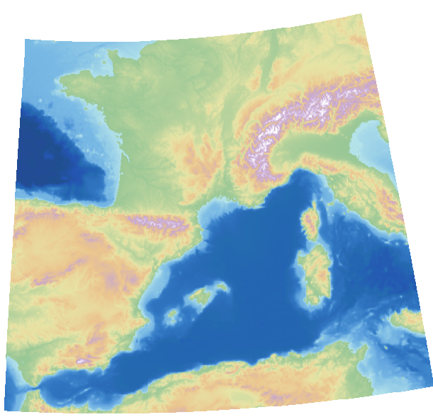

# Direct Import SDK

The Direct Import SDK allows an application to load a wide variety of data formats at runtime in a scalable and performant manner.

The TSLDirectImportDataLayer can load both vector and raster data, including mixed raster/vector from a single file. The layer provides the ability to reproject data to the specified output coordinate system along with various vector and raster processing options.

Many of the options and concepts used by the Direct Import Layer are similar to those in MapLink Studio.

This includes the ability to export a feature rendering configuration from MapLink Studio in order to style vector data within the Direct Import Layer.

## Library Usage and Configuration

**As of version 11.1, MapLink is no longer supplied with Debug or 32-bit libraries.** Therefore, your application's build should link against the Release Mode libraries in all configurations.

**MapLinkDirectImport64.lib** Release mode, DLL version. Uses Multithreaded DLL C++ run-time library. Must also link the MapLink CoreSDK library MapLink.lib/MapLink64.lib Requires TTLDLL preprocessor directive. Refer to the document "MapLink Pro X.Y: Deployment of End User Applications" for a list of run-time dependencies when redistributing. Where X.Y is the version of MapLink you are deploying. |

## Supported Data Formats

The TSLDirectImportDataLayer does not impose any restrictions on file formats. Instead these are determined by the available implementations of TSLDirectImportDriver.

Each TSLDirectImportDriver may support a range of configuration options. These options may be set globally via the configuration files under the MapLink config directory/directimport.

Current formats supported are listed in Appendix B.

## Data Layout and Scale Bands

The TSLDirectImportDataLayer may load a mixture of raster and vector data, which may be displayed in any order.

One data path (A file path, web service URL or other data identifier) may correspond to multiple instances of TSLDirectImportDataSet, with each data set corresponding to a sub-layer within the data. Simple formats such as shapefiles will only contain a single dataset, which will correspond to the vector feature within the data. These data sets are handled independently of each other, and as such may be loaded on a selective basis. Data sets may also be loaded with different per-dataset settings such as feature rendering, and raster adjustments.

In order to load a dataset the application must call addScaleBand at least once. Each scale band within the data layer functions in a similar way to detail layers in a map, or layers within a MapLink Studio project.

Only one scale band will be displayed by the data layer at a time.

The selection of scale bands is based upon a calculated display scale, such as 1:100,000. In order for this to be accurate the application should set the parameters of the display via TSLDrawingSurfaceBase::setDeviceCapabilities. On some platforms these capabilities may be set automatically by the drawing surface.

A data set may be loaded into multiple scale bands. This may be used to display data as a background for all display scales. For raster data overview datasets may be loaded if present in the original data. These are reduced resolution versions of the data set suitable for loading into overview layers.

Data loaded into a scale band will be split into tiles for processing/display. These tiling levels may either be set by the application or calculated automatically. The automatic tiling calculation is based upon the minimum display scale of the band and will create more tiles for more detailed scales. Applications must ensure that data is loaded at an appropriate scale in order to maintain performance.

## Data Processing and Display

When a data set is loaded into the layer it will be split into several tiles (based on the scale band configuration) and processed asynchronously. Once a tile has been processed it will be stored in the on-disk cache and displayed. If the data needs to be reloaded after this point it will be loaded from the on-disk cache.

Data will be scheduled for loading based on the current view extent, and the extentExpansion setting of the layer. The application may also request that a specific extent be processed, by calling preprocessData.

Complex vector data, or large amounts of raster data may take a long time to process. It is advisable to call preprocessData for these datasets prior to the point they need to be displayed in order to pre-process the data into the on-disk cache.

## Callbacks

The TSLDirectImportDataLayer is fully asynchronous and will rarely block the calling thread for any significant amount of time.

In order to achieve this the following callback classes are provided:

TSLDirectImportDataLayerCallbacks - The application should always provide an implementation of this class. It provides the application with feedback on data processing, and is used to request that the application redraws the drawing surface.

TSLDirectImportDataLayerAnalysisCallbacks - The application should provide an implementation of this class when performing data analysis operations. An implementation of this class is not required when loading data for display.

## Vector Specific Settings and Styling

Other than styling/feature rendering information vector specific settings are provided via TSLDirectImportVectorSettings.

Styling information for vector data is provided as a TSLFeatureClassConfig. This information may be set on a per data set basis and may include rendering specific to each scale band. A feature configuration may be created through the MapLink API, or by exporting a MapLink Studio feature book as an MLD File.

The TSLFeatureClassConfig and associated classes provide many of the concepts used by MapLink Studio, including:

- A hierarchical list of features

- Different configuration for features based on product specification/detail level. When used in the Direct Import SDK product specifications must be set on the dataset prior to loading via TSLDirectImportDataSet::product.

- Feature masking

- Automatic feature classification, for example with either a single feature per attribute value or classification based on a range of values

- Multiple levels of feature classification

- Text label generation based on attribute values

- Data Analysis

The direct import layer provides functionality to analyse a dataset and produce an initial TSLFeatureClassConfig. This will populate the feature configuration with a list of features found in the data.

If present in the data, and supported by the direct import driver, the feature configuration may include feature classification, masking and rendering information.

This analysis can often take a long time as it requires iterating over all the source data. This should be performed as an offline process, in order to produce a feature configuration for the data or product. Alternatively, the feature configuration may be exported from the MapLink Studio feature book.

## Raster Specific Settings

Any raster specific settings for a data set are provided via TSLDirectImportRasterSettings.

## Caching

### In-Memory Cache

The in-memory cache will store processed and displayed data in memory. Data will be prioritised based on the most recently drawn area of the world and will automatically be swapped to the on-disk cache when required. The cache size will directly affect the display of vector data, and processing of both vector and raster data. If the in-memory cache size is too small, it may trigger a high amount of disk IO when panning the map display.

### On-Disk Cache

The on-disk cache will store processed data on disk, along with the parameters used to create the data. Like the in-memory cache data will be prioritised based on the most recently drawn area of the world. This cache may be left on disk once the data layer is destroyed and re-used in a future run of the application. Any data which is loaded with the same settings as before will be loaded from disk, instead of being processed from the source data. The cache size will affect the amount of disk space used by the layer. If the on-disk cache size is too small it will cause the data to be processed from source, which may delay the appearance of data on the display.

### Raster Draw Cache

The raster draw cache is used to cache raster data when drawing. The cache size will affect the amount of raster data which can be displayed at a time. If the raster draw cache size is too small raster data may not be drawn and will greatly reduce performance of the map display.

## Optimising Raster Data for Direct Import

One of the standard Direct Import Drivers for MapLink Pro uses GDAL/OGR to load the data. This allows a user to take advantage of gdal command line utilities to optimise the data for use in the runtime environment.

### Creating Overview Layers

A common way to allow an application to load raster images with high performance is to produce reduced resolution versions of data that are used when the display is at an appropriate scale. Some formats can have these overview layers inherently within for the format specification, others do not support it or leave it as optional. MapLink Studio does this automatically by default for processed maps.

GDAL/OGR provides the 'gdaladdo' command line utility which allows you to create overview layers which sit alongside a raster image but are automatically picked up when the raster is loaded in the Direct Import SDK. Note that GDAL does not support interpolation of 8-bit palette images, so producing overviews for this kind of data may improve performance but reduce the quality.

### Combining Raster Mosaics

One common scenario is for a related set of raster images to be supplied as individual tiles. This can be cumbersome to manage in an application. GDAL/OGR has the concept of a 'Virtual Raster', which is made up of a group of rasters but behaves to the application to like a single image. The command line utility to produce this is 'gdalbuildvrt'. The options to this utility are flexible and can also be used in tandem with other utilities. The following sequence allows a mosaic of terrain files to be loaded.

Create a list of files that make up the mosaic. On Windows, from a folder containing subfolders with DTED .dt0 files, this might be:

dir /b /s /a-d \> files.txt

Combine those into a single file that can be loaded into the Direct Import Data Layer:

gdalbuildvrt --input_file_list files.txt dted.vrt

Style the DTED files using a colour relief:

gdaldem --color-relief --of VRT dted.vrt \<MAPLINK_HOME\>\\config\\colourramps\\elevationCombined.ctr styled_dted.vrt

The 'styled_dted.vrt' should be loaded into the Direct Import Data Layer as a single styled raster, producing an image such as:

## Direct Import Drivers

Direct Import 'drivers' provide support for each data format via a plugin architecture. When created the TSLDirectImportDataLayer will load all available drivers.

These libraries must be located at \<Location of MapLinkDirectImport DLL\>/plugins/directimport/. In a MapLink installation this corresponds to \<MapLink Bin Directory\>/plugins/directimport/.

As with other MapLink libraries there are multiple configurations of each driver. Only one of these configurations will be loaded at runtime based on the configuration of the MapLink Direct Import DLL.

