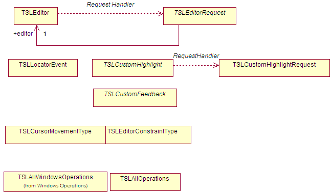

# Editor SDK

The Editor SDK provides an easy way for a MapLink Pro application to support the creation, management and update of vector overlays. It is used in many applications ranging from complex CAD-style editing for property Title Deeds to complex mission planning tactical graphics.

## Library Usage and Configuration

As of version 11.1, MapLink is no longer supplied with Debug or 32-bit libraries. Therefore, your application's build should link against the Release Mode libraries in all configurations.

+-------------------------------------------------------------------------------------------------------------------------------------+
| MapLinkEDT64.lib                                                                                                                    |
|                                                                                                                                     |
| Release mode, DLL version.                                                                                                          |
|                                                                                                                                     |
| Uses Multithreaded DLL C++ run-time library.                                                                                        |
|                                                                                                                                     |
| Requires TTLDLL preprocessor directive.                                                                                             |
|                                                                                                                                     |
| Refer to the document "MapLink Pro: Deployment of End User Applications" for a list of run-time dependencies when redistributing. |
+-------------------------------------------------------------------------------------------------------------------------------------+

## Concepts

The Editor SDK adds two new key concepts to those you will already be familiar with:

- Operations

- Select List

- The primary application interface goes through two principle classes:

- Editor manager - TSLEditor for instructions from the application to MapLink

- Editor request handler - TSLEditorRequest for requests from MapLink to the application.

- Custom Operations allow an application to evolve and expand the functionality of the SDK using two further main classes

- User operation - TSLNUserOperation

- Operation request handler - TSLNUserOperationRequest

### Operation

In the Editor SDK, an operation encapsulates all functionality required to implement a user interaction. There are four main styles of operation:

1.  One-shot style - e.g. "Delete all selected entities"

2.  Creation style - e.g. "Allow me to draw a polygon". These operations will automatically clear the select list when triggered and are expected to add the created object to the select list.

3.  Manipulation style - e.g. "Allow me move points of selected entities". These operations will automatically deactivate and current operations and are expected to manipulate the select list or the entities referenced by it.

4.  Attribute style - e.g. "Set the fill colour of a selected polygons to red". These operations are expected to be transitory and perform simple, non-destructive changes to the entities on the select list. They leave any existing operation as active. If they are invoked with nothing on the select list, then most attribute operations will be expected to store 'default' values. They are often invoked by 'creation' options to apply current styling to the newly created objects.

They can response to events passed by the application and make requests for user input or application action where necessary. In general, the standard operations follow the "S*elect objects, then select action to perform on the objects*" paradigm.

### Select List

The Select List is an ordered list of entities that the user has clicked on. In addition to the actual fact of selection, the Select List also includes information about whether a specific vertex or point on the entity was selected.

It is managed by the Editor SDK, but used, updated, and manipulated by individual operations.

## Editor Application Architecture

MapLink has unparalleled flexibility amongst GIS components. Virtually all MapLink Pro SDK classes are passive in that they:

- Do not create windows

- Do not force a main loop on the application

- Do not trap events

- Do not generate events

**Exception**: Some Editor SDK operations will redraw the window, unless the application has provided a mechanism to override that behaviour and redraw the window on the SDKs behalf.

This design increases portability and flexibility, but your application needs to pass on key events to the SDK, including initialisation, resize, paint and mouse events.

### Limitations and Interaction with Other MapLink Pro SDKs

You can only have one TSLEditor instance per application, to which you must add the operations you want available. The TSLEditor can only be attached to one TSLDrawingSurface at a time, although it can swap to another.

The Editor SDK will only edit vector TMF Geometry stored in a TSLStandardDataLayer and will assume that it should create, select and modify data in the topmost editable, selectable TSLStandardDataLayer:

- TSLPropertyDetect is true on the Drawing Surface data layer properties.

- TSLProperySelect is true on the Drawing Surface data layer properties.

Before changing or storing contents outside of the editor (e.g. via load or save), you must call reset to clear select list, which will remove highlighting and any held references. After changing the contents of the editable layer outside of the editor, you must call TSLEditor::dataChanged to reattach the editor to the edit layer.

## User Interface Considerations

When deciding to integrate the Editor SDK into your application, you will need make some key decisions about how your application will handle user interaction. For instance:

- Which operations are required or useful? Too many can lead to an unnecessarily complex user interface.

- Standard / custom operations. Are the standard variants appropriate, or do you need to provide additional functionality.

- Display of prompt messages and errors. How is this done? Typically, this might be through status bar messages, but this may not be appropriate.

- Handling of user entry - dialogs and text. Some operations may need a user to enter some text or make a choice from a number of options. How should this happen?

- Highlighting and selection of entities. What style of highlighting and selection is required? The Editor SDK provides two different standard ways - one CAD-style, the other more like a traditional Windows drawing application. Both can be adapted for rendering styles and colours without any code.

- Inter-relationship with view handling - zoom/pan/grab etc - This is especially important when using Context Menus. The standard Interaction Modes can be used for a simple integrated solution.

- Full feedback and GUI selection of entities. The standard operations allow a user to select entities by clicking on them. By using the feedback handlers, an application can maintain a separately displayed list of current objects and use that to interact with the select list.

- Configuration of rendering attributes. Does your application work with a limited set of rendering styles and colours for a particular domain, or does it need full user control over styling?

- Advanced point handling - point/object snapping, constraints etc

## Configuration

In addition to the standard Core SDK styling configuration files, the Editor SDK requires two more files:

- A configuration file specifying setup information

- A messages file for text strings passed to the application

These can easily be customised or swapped at start up to support other locales.

### Configuration File Format

Look at the example configuration file for the one of the Editor SDK samples. For example, \<MAPLINK_HOME\>samples\\NT\\SimpleEditorInteraction\\editor.ini

The only section required by the TSLEditor is the \[editor\] section. This may be combined with other sections for an application. All the settings under the editor section have documentation to describe what they do.

Adjacent to the sample's configuration file is its messages file, tms_msg.msg. The first section lists the categories of the entries. Only two are used currently TMS_MSG_INFO and TMS_MSG_ERROR. The second section lists the entries in the format: Number, Identifier, Category and Message Text.

e.g. 220 AP_EXTRUSION TMS_MSG_INFO Select start of section to extrude

Use the 'msg2header' utility to generate a header file from this, which can then user used by the application to inform the Editor SDK which prompts and errors to display. This separation of messages and code allows an application to select from several localised message files if necessary.

## Editor Management

The TSLEditor class provides the application with its main interface into the Editor SDK. It provides several types of method for the application to control the Editor and its operations.

Some methods are for configuration:

- initialise

- addCustomHighlight

- enableGlobalUndo

Some methods are event drivers:

- activate

- locator

Some methods are queries for user interface feedback:

- activatePossible

- querySelectedAttributes

The TSLEditor instance is attached to a TSLDrawingSurface using the 'attach' method and edits objects in the top-most, selectable, detectable TSLStandardDataLayer.

## User Interface Handling

The TSLEditorRequest class allows the application to control its own user interface. An application must provide a derivation of this class to the TSLEditor. All Editor SDK classes and operations use these handler functions to request that the application supply some information to, or request information from the user. This covers:

- Entry of some text

- Display of prompt messages and error strings

- Choose from a set of options

- Event feedback - redraw, cursor movement

- Cursor style changes

## Activating Operations

Operations are activated by name, which is defined in the operation's class documentation. Please refer to the MapLink API documentation. Typically, the names is all lower case.

m_editor-\>activate("polygon");

An application can pass in an object as user data for an operation. The operation's class documentation will note where this is necessary and the type that is required. Any user data is stored by the current operation and may be queried - although some operations don't permit this.

TSLRenderingAttributes ra ; // Now configure rendering attributes

editor-\>activate("renderingattributes", &ra);

## Integrating the Editor SDK from First Principles

Starting with a copy of the MFC Sample which only displays a map, we will now add an Editor SDK from scratch, using a separate dialog to display feedback and messages. In your own application, this could perhaps be in a status bar, as per the more complex Editor samples.

**NOTE**: The next section proves a simpler way to integrate the Editor SDK for an application that already use the standard TSLInteractionModes, such as an instance of the Simple Interaction sample, or an application created using the Visual Studio wizard.

### Set up the application configuration

Add the Editor SDK libraries to the relevant project linker settings. Add an include to "stdafx.h" for "MapLinkEDT.h" (just after the existing "MapLink.h) which will pull in all of the relevant Editor SDK classes and types.

In the sample Doc class, instantiate a TSLStandardDataLayer once a map is loaded. Add/remove the data layer to the drawing surface when the map data layer is added/removed. Set the TSLPropertyDetect and TSLPropertySelect properties on the data layer to both be true.

### Provide prompt capability for the Editor SDK

Create a small dialog to display the editor feedback messages for operation prompts and select list count. In your application main window, instantiate one of the feedback dialogs.

Create a new class and derive it from TSLEditorRequest. In its constructor, pass the instance of the feedback dialog and override the following methods:

- TSLEditorRequest::displayPrompt - Use the parameter to set the text for the prompt label in the feedback dialog.

- TSLEditorRequest::displayError - Show a message box containing the error message.

- TSLEditorRequest::onSelectionChanged - Set the text for the select list label.

### Initialise the Editor

Construct an instance of the TSLEditor, passing your TSLEditorRquest derived class. Call initialise on the TSLEditor instance, passing the full path to the .ini file.

Call attach on the TSLEditor instance, passing the drawingsurface.

Call dataChanged on the TSLEditor instance, to attach to the edit layer.

Add all standard operation to the editor - TSLAllOperations.add( editor ).

Call reset to on the TSLEditor to start the default operation.

Activate the rendering attributes operation, passing the name "renderingattributes" and a populated TSLRenderingAttributes instance to define the initial rendering attributes.

### Capturing and processing user interactions

Create a new derivative of the TSLViewMode class for interacting with the Editor - TSLViewModeEditor. In the new view mode, override Button and Mouse methods and pass the events on to the TSLEditor::locator method.

**Note** - positions must be converted from DUs to TMCs using the drawingSurace DUToTMC method.

**Note** - You will need to change the signature of the basic onMouseMove method to provide the currently pressed mouse buttons, since some operations required those.

### Invoking Operations

Add a toolbar button to activate the editor mode, alongside the 'pan', 'zoom' modes.

Add 'polygon' and 'delete' toolbar buttons and in event handlers for those, call activate on the TSLEditor instance, passing the appropriate operation name.

## Integrating the Editor SDK from using Standard Interaction Modes

Note: The 'Simple Editor Interaction' sample provides an example of these completed steps, with the additional provision of a Context Menu.

Start with a copy of the Simple Interaction sample of the Visual Studio generated sample application. Do the same steps as described in Sections [19.9.1](#set-up-the-application-configuration) but also add 'MapLinkEDTIMode.h' as a required header file.

### Initialise the Editor

In the same class that has provided the 'TSLInteractionModeRequest' overrides for the standard Interaction Modes, also derive from TSLInteractionModeEditorRequest - typically the View. This provides a single point of interface.

Provide overrides for displayError, displayPrompt and onSelectionChanged as per Section [19.9.3](#initialise-the-editor).

Where the standard Interaction Modes are created and added to the mode manager, (typically the View::OnInitialUpdate), also instantiate an instance of TSLInteractionModeEdit, passing in the path to the initialisation file and provide the TSLInteractionModeEditorRequest derivative. Add the new mode to the manager as the default mode.

### Invoking Operations

Add a toolbar button to activate the editor mode, alongside the 'pan', 'zoom' modes. Add 'polygon' and 'delete' toolbar buttons and in event handlers for those, call activate on the TSLEditor instance that can be retrieved from the edit interaction mode, passing the appropriate operation name:

> m_editMode-\>editor()-\>activate( "polygon", 0 ) ;

## Custom User Operations

The TSLUserOperation abstract class allows the application to:

- Create brand new operations;

- Override or extent existing operations.

Methods are triggered automatically by the Editor SDK in response to events or application queries.

### Types of Custom User Operation

User operations can be one of several types:

- Simple - add additional functionality on to an existing operation. e.g. Add extra data to newly created primitives;

- Duplicate newly created primitive in external data store;

- Perform additional validation;

- Aliased - create variants of existing operations. Allows original to be kept too;

- Custom - brand new operations, unrelated to existing operations. Could be similar, but with different interactions.

### Custom User Operation Event Handlers

User operations will be called by the TSLEditor in response to user or application triggered events. They typically return the ID of a message that should be displayed as a prompt - specifically when a state machine driving the interaction may have changed. Return 0 to leave the prompt unchanged.

Overridable methods include:

- **activate** - Called when operation is activated, passed the input data.

- **activatePossible** - Called to check whether it's possible to activate this operation. E.G. The delete operation can only be activated when there is something on the select list.

- **backup** - Called to step back one step in the interaction. E.G. Go back one point when drawing a polygon.

- **backupPossible** - Called to check whether it is possible to go back!

- **constraintChanged** - Called when vertical/horizontal/equal/unequal constraint changes - This can affect echo.

- **deactivate** - Called when the operation is deactivated, usually when another is made active.

- **dialogEntered** - Called when the user responds to a dialog entry request.

- **done** - Called when the user indicates completion - usually by a right mouse button press.

- **locator** - Called when mouse event is passed to the editor.

- **reactivate** - Called to re-activate the already active operation, possibly with new activation data or to reset it back to its initial state.

- **requestHandler** - Called upon initialisation to attach operation to handler.

- **resetUndoBuffer** - Called to indicate that the any undo buffer should be cleared as another operation has since been invoked and undo data no longer required.

- **textEntered** - Called when user responds to text entry request via handler.

- **undo** - Called when user asks to undo previous action.

- **undoPossible** - Called to see whether it's possible to undo last action.

### Custom Operation Support

The TSLUserOperationRequest class provides custom operations with their main interface into the Editor SDK. A custom operation should prefer to use this mechanism to interact with the application, in order to ensure that the Editor SDK remains in a known state.

The methods on this class allow the operation to:

- Query and control the select list;

- Pass feedback to the application or the user;

- Request user input;

- Configure dynamic (rubber band) echo;

- Configure static (point/line) echo;

- Access Editor configuration information.

### Custom Operation Echo Styles

Many custom operations require echo of some description. These would be set by an operation calling 'setDynamicEcho' and/or 'setFixedEcho' where relevant on the interaction. Note that most dynamic echo styles will automatically update position based on the mouse move and current constraints - an operation does not need to update the echo itself in response to the mouse move event.

There are several types available, each in different styles:

- Dynamic Echo;

- Rubber band style, often (partially) moving with the cursor;

- Segments;

- Rectangles;

- Scaling rectangles;

- Corners;

- Spatial calculations - ray, parallel;

- Constraints automatically applied where relevant;

- Primitive echo;

- Points or polylines.

The styles and rendering attributes used to draw these are defined in the .INI file. Note that echo styles are reset between operations.

## Advanced Editor SDK Topics

The following topics will be covered in more detail in a future release but see the API documentation for more information.

Custom feedback handler - Everything you ever wanted to know about what the Editor SDK and operations are doing. Must provide feedback in custom operations.

- GUI integration - activatePossible, backupPossible and undoPossible;

- querySelectedAttributes;

- Feedback handler for selection trees;

- Custom rendering attribute panels;

- Windows highlighting, selection and movement modes;

- Custom highlighting - Total control over highlighting.

