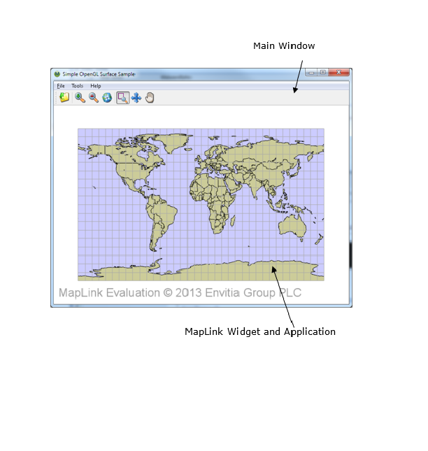
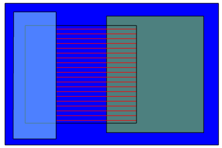
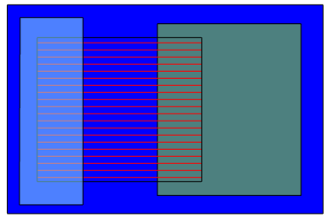
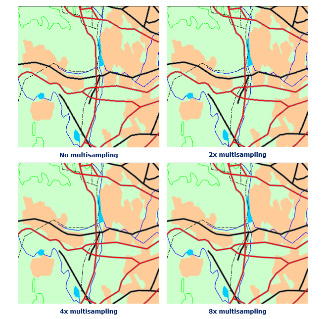
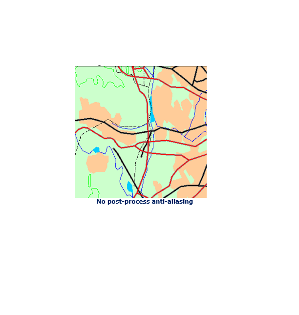
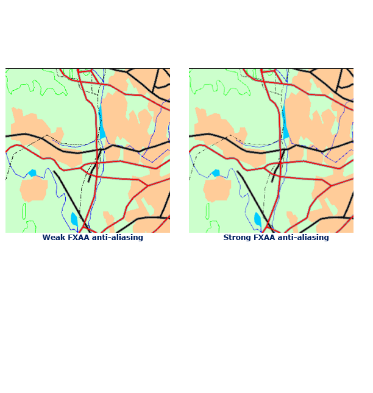
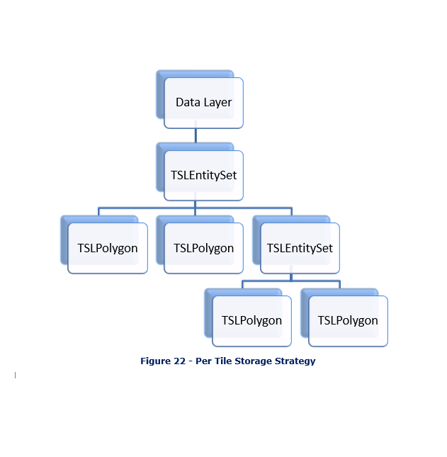
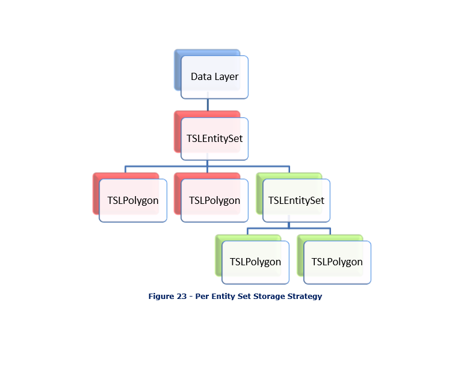
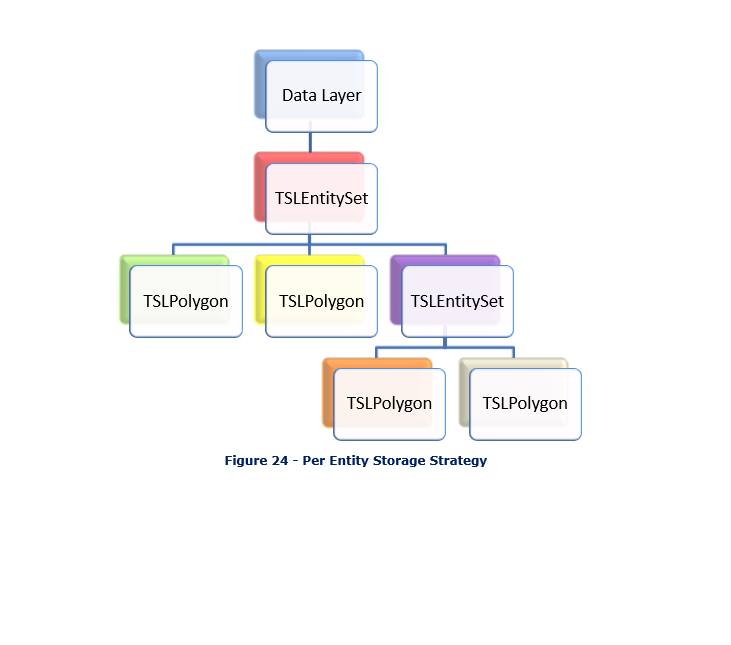

---
title: "OpenGL Drawing Surface"
---

# OpenGL Drawing Surface

The OpenGL drawing surface allows an application to take advantage of
hardware acceleration to enable high performance visualisations on both
desktop and mobile platforms. In many circumstances it can be used as a
drop-in replacement for the GDI-based and X11-based drawing surfaces
from the Core SDK.

## Library Usage and Configuration

The OpenGL surface comes in either Debug or Release configuration. It
should be noted that the library to be linked with should be determined
by the Core SDK library that you are using within your application. For
example, if you are using the Release mode, DLL version of the Core SDK
(MapLink64.lib) then you must also use the equivalent OpenGL surface
library (MapLinkOpenGLSurface64.lib).

<table class="doc-table">
  <tbody>
    <tr><td><strong>MapLinkOpenGLSurface64.lib</strong> Release mode, DLL version. Uses Multithreaded DLL C++ run-time library. Must also link the MapLink CoreSDK library MapLink64.lib Requires TTLDLL preprocessor directive. Refer to the document \"MapLink Pro X.Y: Deployment of End User Applications\" for a list of run-time dependencies when redistributing. Where X.Y is the version of MapLink you are deploying.</td><td><strong>MapLinkOpenGLSurface64d.lib</strong> Debug mode, DLL version. Uses Debug Multithreaded DLL C++ run-time library. Must also link the MapLink CoreSDK library MapLink64d.lib Requires TTLDLL preprocessor directive. No redistributable run-time available. <strong>KEYED: Development machines only.</strong></td></tr>
  </tbody>
</table>

## Hardware Requirements

The OpenGL surface requires **OpenGL 2.1** or later (for desktop) or
**OpenGL ES 2.0** (for mobile/embedded) compliant hardware in order to
function. Systems that do not meet this requirement should use either
the TSLNTSurface on Windows or the TSLMotifSurface on X11 platforms.

Note: **Integrated motherboard chipsets, such as Intel Integrated
Graphics, should be avoided if at all possible for desktop/laptop
applications.**

The table below lists any additional extensions that will be used by the
surface depending on the OpenGL version it is running on. Recommended
extensions are not required for the surface to operate but may have a
negative impact on performance or functionality if not present.

<table class="doc-table">
  <tbody>
    <tr><td>OpenGL Version</td><td>Required Extensions</td><td>Recommended Extensions</td></tr>
  </tbody>
</table>
| 2.1          | EXT_framebuffer_object or | NV_primitive_restart^1^     |
|              | ARB_framebuffer_object    |                             |
|              |                           | ARB_texture_multisample^2^  |
<table class="doc-table">
  <tbody>
    <tr><td>3.2</td><td>None</td><td>EXT_direct_state_access^1^</td></tr>
  </tbody>
</table>
| ES 2.0       | None                      | OES_standard_derivatives^3^ |
|              |                           |                             |
|              |                           | OES_element_index_uint^4^   |
+--------------+---------------------------+-----------------------------+

1.  These extensions allow for improved performance if present but do
    not affect the functionality offered by the drawing surface.

2.  Without this extension multisample anti-aliasing cannot be applied
    to buffered or transparent layers.

3.  If this extension is not present very large pieces of text (\> 150
    pixels) may have noticeable aliasing.

4.  If this extension is not present the surface is limited to rendering
    polygons or polylines with a maximum of 65536 coordinates. Any
    polygons or polylines with more than this number of coordinates will
    not display correctly. This is a hardware limitation.

## Where to Begin?

The first question to ask is whether the OpenGL surface is suitable for
your application. There are several points to consider when answering
this question, including:

**The availability of hardware acceleration on the target devices.** An
application intended to run primarily on virtual machines or very old
hardware will likely not gain any benefit using the OpenGL surface over
the TSLNTSurface or TSLMotifSurface.

**Any custom rendering the application will perform.** If the
application contains a large amount of GDI or Xlib rendering code it
will be more difficult to integrate the OpenGL surface into the
application than the TSLNTSurface or TSLMotifSurface. Additionally, the
overhead of merging the output of the two separate rendering APIs may
outweigh any performance improvements gained from using hardware
acceleration.

**Any requirements on identical rendering output on different
hardware.** OpenGL does not require implementations to produce identical
outputs from the same set of rendering commands, so the same application
will produce slightly different output when run on different hardware.
These differences are not usually visible to the eye but will show up
when performing a binary comparison between the output of different
systems.

**Developer familiarity with OpenGL**. The drawing surface is not a
complete graphics engine; therefore, some knowledge of OpenGL is
necessary to implement any custom drawing required beyond that offered
by the MapLink rendering API (TSLRenderingInterface and geometry).

### Graphics Drivers

When using the OpenGL drawing surface, it is vitally important to use
up-to-date graphics drivers for your hardware. Old graphics drivers can
have missing features, poorer performance and bugs that can cause the
drawing surface to malfunction or render incorrectly. Upgrading to the
newest graphics drivers for your hardware should always be first step in
diagnosing problems.

### Which Class Should be Used?

The OpenGL surface is accessed through a variety of window system
interface classes, similar to how TSLNTSurface provides an interface
between MapLink and Windows-based systems and TSLMotifSurface provides
and interface between MapLink and X11-based systems.

The interface classes for the OpenGL surface are named based on the
interface they use as follows:

+------------------+--------------------------------------------------+
| Windowing System | Applicable OpenGL Surface Classes                |
<table class="doc-table">
  <tbody>
    <tr><td>Windows</td><td>TSLWGLSurface</td></tr>
  </tbody>
</table>
| X11              | TSLGLXSurface                                    |
<table class="doc-table">
  <tbody>
    <tr><td>Embedded/Mobile</td><td>TSLEGLSurface TSLNativeEGLSurface^1^</td></tr>
  </tbody>
</table>

1.  This class may not be present on all platforms - see the Release
    Notes for your platform for more information.

The TSLOpenGLSurface class contains the common functionality across all
platforms.

### What is the Difference Between TSLEGLSurface and TSLNativeEGLSurface?

On some embedded platforms there is a choice between these two window
system interface classes. Both are intended to be used with OpenGL ES
2.0 systems via EGL, however TSLEGLSurface does not link against the
system EGL library and thus cannot create or manage OpenGL contexts
itself. This makes it usable across multiple different systems with
different EGL libraries, whereas TSLNativeEGLSurface is tied to a
specific EGL implementation.

Generally, you should use TSLNativeEGLSurface when:

- You want the easiest way of creating a MapLink drawing surface.

- You are not integrating with other code that performs its own OpenGL
  context management.

You should use TSLEGLSurface when:

- TSLNativeEGLSurface is not available.

- You wish to manage all OpenGL contexts yourself.

Unlike the other window system interface classes, TSLEGLSurface only has
one constructor that takes no arguments. This creates the drawing
surface in a detached state (where it is not associated with an OpenGL
context), so the attach method must be called from a thread that has the
OpenGL context to use bound to it. For the TSLEGLSurface the
requiresDisplayMetrics method will always return true, so the
application must call setDeviceCapabilities or setDisplayMetrics with
the appropriate values before any drawing is performed.

### Additional Data Layers for use with the OpenGL Surface

When using the OpenGL drawing surface to display maps created by MapLink
Studio, applications have a choice of two data layers, the
TSLMapDataLayer and the TSLStaticMapDataLayer. Each layer offers a
different trade-off between features and performance, so the best choice
for an application depends on how the layer will be used. Section
[13.6](#additional-data-layers-for-the-opengl-surface) covers the
differences between these layers and when an application would want to
use each one.

## Realtime Reprojection

The OpenGL Drawing Surface supports the concept of reprojecting vector
and raster at runtime on the GPU allowing for the projection centre to
change for every frame.

The following projections are currently supported:

- Mercator

- Transverse Mercator

- Stereographic

- Gnomonic

Additional projections can be added if necessary, please contact
<sales@envitia.com> to discuss.

This functionality relies upon OpenGL extensions that require an up to
date OpenGL driver and modern hardware.

This MapLink Pro extension has been implemented for the Haswell 4600 GPU
on Linux. Extensive testing has been done with this GPU and several
issues have been found and workarounds were implemented. Several issues
were resolved at the driver or lower level. As such we would recommend
that the developer tests the target hardware early enough to ensure that
the GPU and drivers are sufficiently capable and robust for this MapLink
Pro extension. If necessary, we can provide consultancy to help with
this assessment or any necessary tailoring in MapLink to support a
particular GPU.

OpenGL 3.3 is required with the following OpenGL extensions:

- ARB_transform_feedback2

- ARB_shading_language_420pack

- ARB_draw_indirect

- ARB_gpu_shader_fp64 (FP64)

- ARB_shader_subroutine

There are fallback mechanisms for all the above extensions, however the
fallbacks have an impact on performance and complexity of the shaders.

The FP64 extension is one of the more critical extensions. Only a small
number of the projections are supported if this extension is not present
as we must emulate the 64bit double maths. This significantly
complicates the shader code.

The following extensions are used if present:

- ARB_texture_storage

- ARB_shader_image_load_store

For additional information please refer to the MapLink Pro API
documentation for the class TSLOpenGLSurface.

## Walkthrough - The Simple OpenGL Surface Sample

A simple sample application that uses the OpenGL drawing surface is
provided as part of a MapLink installation in order to demonstrate the
basics of using the OpenGL drawing surface. The source code for this
sample can be found in the samples/Qt/SimpleGLSurfaceSample folder of
the installation. This sample uses Qt 5.0. There is also an MFC based
sample based on the Simple Interaction sample to demonstrate the minimal
changes necessary to convert to the new Drawing Surface.

The source files for the sample have the following purposes:

- **main.cpp** contains the entry point for the application.

- **mainwindow.cpp** and **.h** contains event handlers for toolbar and
  menu events, and is the class for the application\'s window.

- **maplinkwidget.cpp** and **.h** contain a simple custom Qt widget
  that the MapLink drawing surface is attached to. This class handles
  interactions with Qt events and callbacks, but uses the Application
  class below to interact with the MapLink API.

- **application.cpp** and **.h** contain the code that interacts with
  the MapLink API. This class is used by the widget above, but is split
  out into a seperate class in order to make it easier to follow the
  interactions with the MapLink API independently of interactions with
  Qt.

Visually, these items correspond to the following parts of the
application:

### Starting the Application - Choosing a Framebuffer Configuration

For convenience, the sample uses Qt to create the OpenGL context that
will be used by the drawing surface. Before this context is created, we
want to suggest to Qt that it uses a framebuffer configuration with
certain parameters. This happens inside main in **main.cpp** with the
following code:

// Qt will be creating the OpenGL context for us. In order for the

// drawing surface to work at its best we ask it to choose a

// framebuffer configuration with a specific set of

// parameters.

QGLFormat f;

// Request a 24-bit depth buffer. A 16-bit depth buffer will also work.

f.setDepthBufferSize( 24 );

// Request a double-buffered configuration to eliminate flickering when

// moving around the map

f.setDoubleBuffer( true );

// Request 4x multisampling anti-aliasing if supported by the hardware

f.setSamples( 4 );

// Request an OpenGL 3.2 core profile context if supported by the
hardware

f.setVersion( 3, 2 );

f.setProfile( QGLFormat::CoreProfile );

QGLFormat::setDefaultFormat( f );

Once we have done this, the main window for the application can be
created and displayed.

If we were letting the drawing surface create its own OpenGL context
then the above would not be needed as the drawing surface would
internally select a suitable framebuffer configuration.

### Initialisation

When the main window of the application is created, this creates the
custom widget (the MapLink widget from **maplinkwidget.cpp**), which in
turn creates the application class (from **application.cpp**). These
objects get constructed in this order:

1.  MainWindow

2.  MapLinkWidget

3.  Application

The MainWindow constructor only deals with installing event handlers for
the toolbar button and menu entries - it doesn\'t contain any
interactions with MapLink.

Similarly, the majority of the MapLinkWidget constructor deals with
ensuring event messages are propagated correctly to the widget.
Additionally, it also instructs Qt to not clear the drawing area
automatically before any drawing occurs as we use the MapLink drawing
surface to do this.

The constructor of the Application class tells MapLink to load its
configuration files from an installation on the host machine by calling
TSLDrawingSurface::loadStandardConfig. This must be done before any
MapLink functionality can be used - without it maps cannot be drawn at
all. This setup only needs to be done once in the application - usually
at start-up.

### Creating the Drawing Surface

The next step is the creation of the drawing surface. Qt will call
MapLinkWidget::initialiseGL inside **maplinkwidget.cpp** to ask the
widget to perform any initial setup. The MapLink drawing surface
doesn\'t interface with Qt directly, it uses the underlying window
handles from the operating system in order to allow it to be used with
different application toolkits. Therefore, a small amount of platform
specific code is needed in order extract these handles from Qt:

// Platform Specific Setup.

#ifdef X11_BUILD

\# if QT_VERSION \< 0x50100

// Extract the X11 information - QX11Info was removed in Qt5

QPlatformNativeInterface \*native =

> QGuiApplication::platformNativeInterface();

Display \*display = static_cast\<Display\*\>(
native-\>nativeResourceForWindow(

> \"display\", NULL ) );

Screen \*screen = DefaultScreenOfDisplay(display);

#else

// Qt 5.1 introduced a different version of QX11Info for accessing
widget native

// handles

int screenNum = DefaultScreen( QX11Info::display() );

Screen \*screen = ScreenOfDisplay( QX11Info::display(), screenNum );

#endif

// pass to the application as we will need for the Drawing Surface

m_application-\>drawingInfo(display, screen);

#else

// The MapLink OpenGL drawing surface needs to know the window handle to

// attach to - query this from Qt

WId hWnd = winId();

// Pass the handle to the application so it can be used by the drawing

// surface

m_application-\>drawingInfo( hWnd );

#endif

These window handles are passed to the Application class for it to use
when creating the drawing surface. The widget then calls
Application::create in **application.cpp** to create the MapLink drawing
surface and attach it to the window handles it just queried.

Creating the drawing surface requires another small amount of platform
specific code - the exact type of drawing surface used depends on the
platform the sample is being run on:

// Tell the drawing surface whether it will need to perform buffer
swaps,

// or whether it is handled externally. See the constructor of

// MapLinkWidget.

TSLOpenGLSurfaceCreationParameters creationOptions;

creationOptions.swapBuffersManually( ML_QT_BUFFER_SWAP );

#ifdef X11_BUILD

// Get the active OpenGL context to attach the drawing surface to

GLXContext context = glXGetCurrentContext();

GLXDrawable drawable = glXGetCurrentDrawable();

// Create the Accelerated Surface object

m_drawingSurface = new TSLGLXSurface( m_display, m_screen, drawable,

context, creationOptions );

#else

HGLRC context = wglGetCurrentContext();

m_drawingSurface = new TSLWGLSurface( (HWND)m_window, false, context,

creationOptions );

#endif

if( !m_drawingSurface-\>context() )

{

// Error handling code

}

In both cases the application queries the active OpenGL context created
by Qt and instantiates a MapLink drawing surface, telling it to attach
itself to this context.

The TSLOpenGLSurfaceCreationParameters class can be used to control the
behaviour of the MapLink drawing surface - in this case it\'s used to
tell the drawing surface not to perform buffer swaps after a draw as we
have already told Qt that it should handle this.

Once the drawing surface is created, we check to make sure that the
context method returns a valid value - if this returns NULL then the
drawing surface did not attach successfully to the OpenGL context and
cannot be used. The most common reason that this might occur is if the
OpenGL implementation on the system does not meet the minimum
requirements for the drawing surface.

Next, the application creates a data layer to load a map created by
MapLink Studio into and adds this to the drawing surface so that its
contents will be drawn when the drawing surface renders.

// Add a map data layer to the drawing surface

m_mapDataLayer = new TSLMapDataLayer();

// Set a cache size of 256Mb on the map layer to avoid reloading tiles

// from disk too frequently

m_mapDataLayer-\>cacheSize( 256 \* 1024 );

m_drawingSurface-\>addDataLayer( m_mapDataLayer, m_mapLayerName );

At this stage the data layer is still empty, so nothing will be drawn
yet.

The final step is the creation of the MapLink interaction mode manager
and interaction modes.

// Now create and initialse the mode manager and modes

m_modeManager = new TSLInteractionModeManagerGeneric( this,

m_drawingSurface );

// Add the three interaction mode types to the manager - the zoom mode
is

// the default

m_modeManager-\>addMode( new TSLInteractionModeZoom( ID_TOOLS_ZOOM ),

true ) ;

m_modeManager-\>addMode( new TSLInteractionModePan( ID_TOOLS_PAN ),

false ) ;

m_modeManager-\>addMode( new TSLInteractionModeGrab( ID_TOOLS_GRAB ),

false ) ;

// Display any errors that have occurred

const char \*errorMsg = TSLErrorStack::errorString();

if( errorMsg )

{

// Error handling code

}

The interaction modes are a set of premade event handlers that implement
some common methods of manipulating the view of a drawing surface based
on user input. In this case we set the manager up to have zoom to
rectangle, pan to point and grab and drag modes. The zoom to rectangle
mode is set to be the default active interaction mode.

### Handling Window Resizing

Although attached to the widget, the drawing surface is still not in a
valid state for drawing as it has yet to be told how big the window to
which it is attached is.

After MapLinkWidget::initializeGL has finished, Qt will immediately call
MapLinkWidget::resizeGL in **maplinkwidget.cpp**. This call is forwarded
to Application::resize in **application.cpp**, which updates both the
drawing surface and the interaction mode manager with the size of the
window they are drawing to.

if( m_drawingSurface )

{

// Inform the drawing surface of the new window size,

// attempting to keep the top left corner the same.

// Do not ask for an automatic redraw since we will get a call to

// redraw() to do so

m_drawingSurface-\>wndResize( 0, 0, width, height, false,

TSLResizeActionMaintainTopLeft ) ;

}

if( m_modeManager )

{

m_modeManager-\>onSize( width, height ) ;

}

Now that the drawing surface knows the window size, it is fully
initialised and ready for drawing.

This same event sequence is used to handle changes to the window size
while the application is running, as the drawing surface must be
notified of any changes to the window to which it is attached.

### Drawing to the Window

When the sample\'s window needs to be redrawn, Qt will call
MapLinkWidget::paintGL in **maplinkwidget.cpp**. This in turn calls
Application::redraw in **application.cpp** to make the drawing surface
draw all of the data layers inside it.

if( m_drawingSurface )

{

// Draw the map to the widget

m_drawingSurface-\>drawDU( 0, 0, m_widgetWidth, m_widgetHeight, true );

// Don\'t forget to draw any echo rectangle that may be active.

if ( m_modeManager )

{

m_modeManager-\>onDraw( 0, 0, m_widgetWidth, m_widgetHeight );

}

}

There is one data layer in the drawing surface - the TSLMapDataLayer we
added inside the Application::create method. Currently this has no map
loaded, so drawing will just clear the widget to the default background
colour, which is white.

### Loading a Map

When the Open Map toolbar button or menu item is selected, Qt invokes
the registered event handler for this action, which is
MainWindow::loadMap in **mainwindow.cpp**. This displays the operating
system\'s standard open dialog to let the user choose the map to load,
and calls MapLinkWidget::loadMap in **maplinkwidget.cpp** to do the
actual task of loading.

The widget does three things when loading a map:

1.  Instructs the application class to load the map into its
    TSLMapDataLayer.

2.  Tells the application to change the view of the drawing surface to
    cover the entirety of the new map, as the previous view of the
    drawing surface is unlikely to provide a useful view of the new map.

3.  Asks Qt to redraw the window so that the new map can be seen,
    triggering the same call sequence as described in section
    [13.5.5](#drawing-to-the-window).

The task of actually loading the data into the TSLMapDataLayer is done
inside Application::loadMap in **application.cpp**.

if( !m_mapDataLayer-\>loadData( mapFilename.c_str() ) )

{

QMessageBox::critical( m_parentWidget, \"Failed to load map\",

mapFilename.c_str() );

return false;

}

if( m_modeManager )

{

// Loading a map invalidates any stored views in mode manager - this

// sample doesn\'t create any

m_modeManager-\>resetViews();

}

Changing the drawing surface view to cover the extent of the newly
loaded map is done inside Application::resetView.

if( m_drawingSurface )

{

// Reset the drawing surface rotation as well

m_surfaceRotation = 0.0;

m_drawingSurface-\>rotate( m_surfaceRotation );

m_drawingSurface-\>reset( false );

}

The sample explicitly asks the drawing surface not to perform an
immediate redraw as this is handled by MapLinkWidget. Any rotation that
has been applied to the drawing surface by the sample is also removed.

### Changing the View of the Map

Keyboard and mouse events that occur when the sample has focus are
received by the MapLinkWidget in the \*Event methods inside
**maplinkwidget.cpp**. Each of these events is passed onto an equivalent
event handler function inside the Application class in
**application.cpp**. In turn, the Application class forwards these
events to the MapLink interaction mode manager associated with the
drawing surface. The manager will change the current view of the map
based on the active interaction mode.

The return value of the interaction mode manager indicates to the
Application class if a redraw is required based on the actions that have
been taken. The Application passes this flag back to the MapLinkWidget
as the return value from the event handler functions, which lets the
MapLinkWidget trigger a redraw of the window when needed.

### Changing the Active Interaction Mode

When the sample is started, the zoom to rectangle mode is the default
interaction mode. This can be changed through the toolbar buttons or
corresponding menu items, which invoke the registered action handlers in
the MainWindow These actions are forwarded on to the MapLinkWidget,
which in turn forwards them on to the Application.

The Application instructs the interaction mode manager to change the
interaction mode using the unique identifiers assigned to each the
interaction modes when they were initially added to the interaction mode
manager when it was created.

void Application::activatePanMode()

{

// Activate the pan interaction mode

if( m_modeManager )

{

m_modeManager-\>setCurrentMode( ID_TOOLS_PAN ) ;

}

}

void Application::activateZoomMode()

{

// Activate the zoom interaction mode

if( m_modeManager )

{

m_modeManager-\>setCurrentMode( ID_TOOLS_ZOOM ) ;

}

}

void Application::activateGrabMode()

{

// Activate the grab interaction mode

if( m_modeManager )

{

m_modeManager-\>setCurrentMode( ID_TOOLS_GRAB ) ;

}

}

## Additional Data Layers for the OpenGL Surface

When using the OpenGL drawing surface applications can use an additional
data layer called the TSLStaticMapDataLayer. This data layer is an
alternative to the TSLMapDataLayer that does not support the more
advanced features of the TSLMapDataLayer, but in return offers
significantly higher drawing performance.

The TSLStaticMapDataLayer lacks the following features of the
TSLMapDataLayer:

- Runtime projection

- Flashback

- Support for dynamic renderers

- Persistent tile caches

If any of these features are required in an application then the
TSLMapDataLayer should be used, otherwise the TSLStaticMapDataLayer may
be more suitable.

The API of the TSLStaticMapDataLayer is almost identical to that of the
TSLMapDataLayer so it is simple for an application to switch them as
desired. The primary difference between the two data layers is in the
methods that control each layer's cache (cacheSize and clearCache). In
the TSLStaticMapDataLayer this is split into two different sets of
methods, one used for drawing and one used for querying (such as the
findEntity or query methods).

In addition to allowing for finer control over the memory use of the
layer, the split allows for more flexible use of the data layer. Unlike
the TSLMapDataLayer, with the TSLStaticMapDataLayer an application may
retain the results of a query operation while the layer is redrawn as
the separate caches mean changes to the drawing cache do not affect the
objects returned by a query. It is also possible to use the data layer
query methods on the TSLStaticMapDataLayer from a different thread to
the one that the layer is drawn in, provided the application takes care
to ensure that methods that would trigger a clearing of both caches
(e.g. loadData) are not called without synchronisation inside the
application. Issuing queries from more than one thread against the same
data layer is not supported.

## The Drawing Surface Coordinate System and Custom Data Layers

Separate from the coordinate system used for coordinate transformations
in the drawing surface and data layers via a TSLCoordinateSystem object,
the OpenGL drawing surface defines a different coordinate system that is
used to map the OpenGL coordinate space to the screen. When all
rendering is performed through MapLink data layers and the
TSLRenderingInterface an application doesn\'t need to understand this
coordinate space - it is all taken care of internally. However, when the
application performs its own OpenGL rendering via a TSLCustomDataLayer
or after MapLink has finished drawing it is important to understand how
to correctly position items relative to the map.

The OpenGL drawing surface defines this rendering coordinate space to be
the TMC extent of the area being rendered, without any drawing surface
rotation or dynamic arc scaling included, centred on 0,0 (centre of the
screen). The TMC extent that this equates to from the active
TSLCoordinateSystem can be determined if required as follows, although
it is generally not needed:

TSLDrawingSurface \*surface = \...

TSLEnvelope renderExtent;

surface-\>getTMCExtent(renderExtent);

if(surface-\>getOption(TSLOptionDynamicArcSupportEnabled))

{

// Dynamic arc is enabled, remove any scaling effect applied

// to the envelope

double tmcPerDUX = 0.0, tmcPerDUY = 0.0;

surface-\>TMCperDU(tmcPerDUX, tmcPerDUY);

renderExtent.scale(tmcPerDUY / tmcPerDUX, 1.0);

}

// renderExtent now contains the TMC extent of the surface\'s drawing

// coordinate system in the active TSLCoordinateSystem of the drawing

// surface

As mentioned above, this extent is centred on 0,0 when mapped to the
drawing surface\'s rendering coordinate system (i.e., the bottom left of
the envelope is equal to -width()/2, -height/2 and the top right of the
envelope is equal to width()/2. height()/2). The bottom left and top
right of this envelope map to the bottom left and top right of the
screen - therefore 0,0 in the rendering coordinate system always maps to
the centre of the screen.

### Positioning Items In Practice

Like all OpenGL applications, the OpenGL drawing surface uses matrices
to describe the transformations to perform when rendering items to the
screen. These are divided into two matrices - the modelview matrix which
describes any transformations to be applied within the rendering
coordinate system, and the projection matrix which maps the results of
this to a form OpenGL can interpret.

The drawing surface provides access to its matrices for the current or
previous draw via the modelViewMatrix and projectionMatrix methods on
TSLOpenGLDrawingSurface. The modelview matrix will already contain any
drawing surface rotation or dynamic arc scaling that apply for the draw.
Additionally, for convenience it also provides access to the TMC
position that maps to 0,0 in rendering space via the coordinateCentreX
and coordinateCentreY methods. Note that the centre coordinates are
returned as doubles - they may not necessarily map to integer coordinate
space.

The combination of these items allows for the construction of a
modelview matrix that will correctly locate an item being drawn relative
to the map. Generally, object drawn via OpenGL are object centred - i.e.
their coordinates are defined relative to an origin local to that object
rather than relative to the active coordinate system. Since coordinates
in OpenGL must be provided in 32bit floats in most cases this is
particularly important due to precision - the MapLink TMC coordinate
space uses 32bits of integer precision but 32bit floats only provide
24bits of integer precision. By Object-centring and translating to the
correct location during a draw the problem of jittery movement of
objects when operating near the edges of MapLink\'s TMC space does not
occur.

Putting this all together, the code for positioning an object centred
item for drawing inside a TSLCustomDataLayer might look like the
following:

bool MyCustomLayer::drawLayer(TSLRenderingInterface
\*renderingInterface, const TSLEnvelope\* extent,
TSLCustomDataLayerHandler& layerHandler)

{

TSLOpenGLSurface \*surface = reinterpret_cast\<TSLOpenGLSurface\*\>(

layerHandler.drawingSurface());

// This contains the TMC location of the centre of the object

// in the drawing surface\'s active coordinate system

TSLCoord objectTMCPosition = calculateObjectPosition();

// Determine the modelview matrix to position the object

// in the right place relative to the current drawing.

Matrix modelViewMat(surface-\>modelViewMatrix());

modelViewMat.translate(objectTMCPosition.x() -

surface-\>coordinateCentreX(),

objectTMCPosition.y() -

surface-\>coordinateCentreY());

if(removeDynamicArcScaling)

{

// This will remove the effect of dynamic arc (if active)

// from any subsequent transformations.

double tmcPerDUX = 0.0, tmcPerDUY = 0.0;

surface-\>TMCperDU(tmcPerDUX, tmcPerDUY);

modelViewMat.scale(tmcPerDUX / tmcPerDUY, 1.0);

}

// Upload the matrices to OpenGL

surface-\>stateTracker()-\>useProgram(m_program);

glUniformMatrix4fv( m_modelViewUniform, 1, GL_FALSE,

modelViewMat.matrix());

glUniformMatrix4fv( m_projectionUniform, 1, GL_FALSE,

surface-\>projectionMatrix());

// Now draw the object

\...

return true;

}

### Interspersing Custom Rendering with MapLink Rendering

The OpenGL drawing surface will internally change the order or defer
drawing for performance reasons, using OpenGL\'s depth buffer to ensure
items appear in the correct order on screen. When all rendering inside a
custom data layer is performed by MapLink or implemented by the
application there is no problem, and everything will work as expected.
However, when mixing both MapLink rendering and custom rendering within
the same data layer application drawn items may not necessarily appear
in the expected order relative to the items drawn through MapLink.

In the simple case where all of the application rendering in the data
layer occurs after all MapLink rendering, the application can use the
flushPendingDraws method on TSLOpenGLSurface to ensure all MapLink draw
commands have been sent to the GPU command stream before beginning
application rendering. This might look as follows:

bool MyCustomLayer::drawLayer(TSLRenderingInterface
\*renderingInterface, const TSLEnvelope\* extent,
TSLCustomDataLayerHandler& layerHandler)

{

TSLOpenGLSurface \*surface = reinterpret_cast\<TSLOpenGLSurface\*\>(

layerHandler.drawingSurface());

// This function performs rendering through the rendering interface

doMapLinkDrawing(renderingInterface);

// Ensure all MapLink rendering is done before we continue

surface-\>flushPendingDraws();

// Custom application rendering in this case does not use the

// depth buffer

surface-\>stateTracker()-\>disableDepthTest();

// Custom application rendering occurs in here

doMyCustomRendering();

surface-\>stateTracker()-\>enableDepthTest();

return true;

}

If the custom rendering is mixed in with MapLink rendering, then it can
often be beneficial to make use of the depth buffer to ensure ordering
in the same way that the drawing surface does. To assist in this the
TSLOpenGLSurface provides the acquireDepthSlice method which can be used
to reserve one or more depth buffer values for custom rendering use. The
value returned is the depth in OpenGL\'s normalised device coordinate
space, which since the OpenGL drawing surface uses an orthographic 2D
projection and so has no perspective division is also OpenGL\'s clip
space. The value can therefore be assigned directly to either
gl_FragDepth in the application's fragment shader or to gl_Position.z in
the application\'s vertex shader.

In the following examples depthValue is the value obtained from calling
acquireDepthSlice:

// Vertex shader example - this method can be used on OpenGL ES 2.0
systems

// where gl_FragDepth is not available

#version 150 core

uniform float depthValue;

uniform mat4 modelViewMatrix;

uniform mat4 projectionMatrix;

in vec2 vertexPosition;

void main()

{

gl_Position = (projectionMatrix \* modelViewMatrix) \* vec4(
vertexPosition,

0.0, 1.0 );

gl_Position.z = depthValue;

}

// Fragment shader example

#version 150 core

uniform vec4 colour;

uniform float depthValue;

out vec4 pixelColour;

void main()

{

gl_FragDepth = depthValue;

pixelColour = colour;

}

When using the depth buffer in this fashion it is not necessary to call
flushPendingDraws in order to ensure correct ordering. Depth buffer
values obtained in this fashion only apply to the current data layer
being drawn as the depth buffer will be cleared when drawing each data
layer.

## Transparency

In addition to per-layer transparency, the OpenGL drawing surface also
allows for per-entity transparency via the
TSLRenderingAttributeEdgeOpacity,
TSLRenderingAttributeExteriorEdgeOpacity,
TSLRenderingAttributeFillOpacity, TSLRenderingAttributeTextOpacity and
TSLRenderingAttributeSymbolOpacity rendering attributes.

When using per-entity transparency, correct visualisation requires that
strict back-to-front rendering order is used, however for performance
reasons MapLink may internally rearrange the order items are drawn in.
This may sometimes lead to the following situation:

This image contains four rectangles in the following order:

1.  An opaque blue rectangle with black opaque edges.

2.  A partially transparent green rectangle with black opaque edges.

3.  A red rectangle with a patterned fill style with black opaque edges.

4.  A partially transparent cyan rectangle with black opaque edges.

With this ordering, the patterned red rectangle should be visible
through the partially transparent cyan rectangle, however after
reordering the rectangles were drawn in this order:

1.  The black opaque edges for all four rectangles.

2.  The opaque blue rectangle fill.

3.  The partially transparent green rectangle fill.

4.  The partially transparent cyan rectangle fill.

5.  The patterned red rectangle fill.

When drawn in this order, the section of the patterned red rectangle
that should be visible through the partially transparent cyan rectangle
has not been drawn at the point the cyan rectangle is rendered, so this
rectangle\'s colour was blended with the opaque blue rectangle instead
of the patterned red rectangle. Effectively it was drawn as if the
patterned red rectangle did not exist. When the patterned red rectangle
is drawn at the end, the section covered by the partially transparent
cyan rectangle does not get drawn again as it is considered to already
be obscured by an object in front (the cyan rectangle).

MapLink attempts to minimise the situations where this might occur.
Specifically, it can only occur when all of the following conditions are
true:

- Rendering that occurs within the same MapLink data layer.

- For data layers that contain multiple tiles (e.g. a TSLMapDataLayer),
  rendering that occurs within the same tile.

- Rendering that occurs at the same render level.

- Rendering that occurs at the same rendering pass (for multi-pass
  linestyles).

- The overlapping transparent items use different fill or line styles,
  or are different types of rendering (e.g. a polygon\'s fill and a
  polygon\'s edge).

- The item being drawn is not a TSLSymbol.

MapLink will attempt to ensure that opaque geometry is drawn before any
transparent geometry where possible, but does not provide any guarantees
of the order that transparent geometry will be drawn in by default. For
situations where the consistently correct display of overlapping
transparent objects is important and the transparent geometry cannot be
put in a separate render level, the drawing surface allows an
application to hint at the required level of correctness through the
TSLOpenGLTransparencyHintEnum enumeration.

This enumeration lets an application specify the following hints about
how it uses transparency on a per-data layer basis, ordered from fastest
to slowest:

1.  TSLOpenGLTransparencyHintNever - MapLink will attempt to draw opaque
    geometry before transparent geometry where doing so will not cause a
    significant performance impact. Opaque geometry may be drawn in any
    order. The rendering order of transparent geometry is not
    guaranteed.

2.  TSLOpenGLTransparencyHintFlushOpaque - Any pending opaque geometry
    not yet rendered will be drawn when a transparent item is
    encountered. Opaque geometry may be drawn in any order. Transparent
    items are drawn in order. The performance impact of this setting
    depends on the number of transparent items in the data layer.

3.  TSLOpenGLTransparencyHintAlways - No draw reordering occurs - all
    items are drawn in order from back to front. This setting has a
    substantial performance impact that increases with the number of
    items drawn.

In almost all cases using TSLOpenGLTransparencyHintNever or
TSLOpenGLTransparencyHintFlushOpaque is sufficient to give acceptable
output - TSLOpenGLTransparencyHintAlways should only be used as a last
resort due to its performance impact.

Going back to the example at the beginning of this section, the same
geometry drawn using the TSLOpenGLTransparencyHintFlushOpaque hint will
be rendered in the expected order, giving this output:

For systems using OpenGL ES 2.0 or OpenGL 3.1 or earlier, entities using
a patterned fill or line style count as transparent for the purposes of
draw ordering. On these systems items that would be visible through the
pattern will not be shown if they are drawn after the patterned item.
When using a system supporting OpenGL 3.2 or later MapLink uses alpha
testing for rendering these items and thus they count as opaque geometry
for the purposes of draw ordering unless the entity has also been set as
transparent via its rendering attributes.

## Anti-aliasing

The OpenGL drawing surface can use two different types of anti-aliasing
to reduce the visibility of jagged edges on vector features. These are
multisampling, which uses features provided by the graphics hardware,
and a post-processing implementation that can be used when multisampling
is not supported.

### Multisampling

Multisampling can be enabled when creating the drawing surface using one
of the constructors that internally create an OpenGL context using the
numMultisampleSamples option of the TSLOpenGLSurfaceCreationParameters
class. The drawing surface will attempt to locate a configuration
supported by the graphics hardware that supports the requested level of
multisampling, but if none exists will use the highest level available
on the hardware. Higher levels provide better image quality at the cost
of lower performance, but modern hardware can generally run with 4x or
higher multisampling without trouble.

The specific levels of multisampling available depend on the graphics
hardware in the system.

The images shown on the next page illustrate the effect of increasing
levels of multisampling on image quality:

The decision on whether to use multisampling must be made at the time
the drawing surface is created - it cannot be enabled or disabled on an
existing drawing surface.

On embedded and mobile systems using OpenGL ES 2.0 multisampling will
not be applied to any buffered or transparent layers (layers using the
TSLPropertyBuffered or TSLPropertyTransparency data layer properties).
On systems that do not support OpenGL 3.2 the ARB_texture_multisample
extension is required.

### Post-processing Anti-aliasing

When the graphics hardware supports multisampling there is little reason
to use post-processing anti-aliasing as multisampling provides better
image quality, but if multisampling is not supported then it can be
better than no anti-aliasing.

Unlike multisampling, post-processing anti-aliasing can be enabled and
disabled at runtime via the TSLOpenGLSurface::setAntialiasingMode method
as long as the drawing surface was not created with multisampling
enabled - multisamping and post-processing anti-aliasing cannot be used
at the same time.

Post-processing anti-aliasing has two available settings - FXAAStrong
and FXAAWeak. The strong setting will remove most jagged edges but will
display noticeable visual artefacts on single pixel thickness features.
The weak setting will sometimes leave noticeable jagged edges but does
not generate artefacts around single pixel features as the strong
setting does.

The images below demonstrate the effect of these settings on image
quality:

When configuring feature rendering for maps and overlaps that is
intended to be used with the post-process anti-aliasing strong setting
it is generally better to avoid using any single pixel wide features
entirely. Instead configure these features to be two pixels wide and
possibly use a slightly lighter colour if the feature may be in areas of
high contrast (e.g. black lines against pale backgrounds). The
anti-aliasing effect softens the lines so that the extra width is not as
pronounced and often provides better quality than using the weak setting
with single pixel thick features due to the reduced aliasing.

## Hardware-Supported Raster Formats

Modern graphics hardware supports a number of specialized raster formats
(normally referred to as 'compressed textures') that are highly
efficient for drawing. These formats are both faster to load and use
less memory than other more traditional raster formats such as JPEG and
PNG as they do not need to be decompressed before drawing.

In order to allow applications to take advantage of these formats, the
TSLOpenGLDataOptimiser utility class provides means for an application
to convert any supported raster format into one of the special
hardware-supported formats at runtime. These converted rasters can then
be loaded as normal into data layers such as the TSLRasterDataLayer as
with any other raster format.

When displaying very high resolution imagery it is advisable to first
generate a raster pyramid from the source raster as described in section
[12.8.3](#raster-pyramids-and-supported-formats) before converting the
raster using the TSLOpenGLDataOptimiser. Graphics hardware is limited in
the maximum resolution of raster that can be displayed (from 2048x2048
on mobile and embedded devices up to 16384x16384 on recent desktop
hardware), so creating raster pyramids is necessary to display images
that are larger than what is supported by the hardware the application
is running on.

Maps created by MapLink Studio that contain rasters can also take
advantage of these specialised raster formats when the map is used with
the OpenGL drawing surface. This can be done either at the time the map
is created by MapLink Studio (refer to the MapLink Studio User Guide for
details), or for existing maps through the TSLOpenGLDataOptimiser. At
runtime MapLink will only attempt to load the image format(s) that are
supported by the hardware, so it is not necessary to prepare a version
of each map for each image format.

## Integrating with Other OpenGL Applications

It is sometimes desirable to use the OpenGL drawing surface in
conjunction with user interface toolkits or other libraries that perform
their own OpenGL context creation and management. For this situation
each of the window system interface classes provides a constructor that
accepts an existing OpenGL context that the drawing surface should use
instead of creating its own.

When creating the drawing surface in this way an application usually
wants to set the swapBuffersManually option from the
TSLOpenGLSurfaceCreationParameters used to false as buffer swaps are
usually managed by the same code that creates the OpenGL context.

To prevent the drawing surface from clearing the colour buffer during a
draw, set the clear argument passed to TSLDrawingSurface::drawDU or
TSLDrawingSurface::drawUU to false. This option only inhibits clearing
of the colour buffer - the depth buffer and stencil buffer (if present)
will still be cleared by the drawing surface.

When changing OpenGL state an application should normally use the
drawing surface\'s TSLOpenGLStateTracker object if it provides a
function that maps to the state being changed. The drawing surface
internally tracks the current OpenGL state in order to remove redundant
state changes being sent to the driver which can affect performance;
thus it must be kept up to date with the actual OpenGL state in order to
function correctly. The initial values of the state tracker are read
from OpenGL on drawing surface creation. If the state of any settings
that the state tracker stores are modified outside of the state tracker
the application should use the reset method to force it to re-read the
current OpenGL state.

### Suggested Framebuffer Configurations

When the OpenGL drawing surface does not create an OpenGL context, it is
up to the application to ensure the framebuffer configuration used is
suitable for use with the drawing surface. The requirements for the
drawing surface are as follows:

- An RGBA framebuffer (GLX_RENDER_TYPE is GLX_RGBA_BIT,
  WGL_PIXEL_TYPE_ARB is WGL_TYPE_RGBA_ARB or EGL_COLOR_BUFFER_TYPE is
  EGL_RGB_BUFFER).

- A depth buffer of 16 bits or greater.

<!-- -->

- On OpenGL ES 2.0 systems EGL_RENDERABLE_TYPE must be
  EGL_OPENGL_ES2_BIT.

> Any other settings may be freely chosen by the application.
>
> The TSLGLXSurface and TSLNativeEGLSurface provide convenience utility
> methods, named preferredVisualID and preferredConfigID, that can be
> used to identify the framebuffer configuration that the drawing
> surface would prefer to use.

## Off-screen Rendering

There are two main scenarios for wanting to make the OpenGL drawing
surface render to an off-screen surface:

1.  To take a frame of output from a drawing surface that normally draws
    to a window and save it for reuse, such as when rendering an
    overview of a map to a texture.

2.  To have a drawing surface that is not attached to a window and
    always draws off-screen.

Almost no graphics drivers allow for hardware acceleration when
rendering to a bitmap or pixmap, therefore the OpenGL drawing surface
cannot be attached to one of these for off-screen rendering. Instead,
OpenGL itself must be used to accomplish this.

The process for the first type of off-screen rendering is consistent
across the various window system interface classes as it only uses
standard OpenGL functionality - framebuffer objects, generally referred
to as FBOs.

The second type of off-screen rendering affects how the OpenGL context
must be created, and thus the specifics differ between Windows, X11 and
EGL based systems.

### Redirecting Drawing Surface Output to a Framebuffer Object

The OpenGL drawing surface respects any framebuffer object (FBO) bound
at the point that it starts drawing and will redirect its output to the
buffers bound to this FBO. Therefore making the drawing surface render
to a texture or renderbuffer is as simple as binding the desired FBO
before calling drawDU or drawUU on the drawing surface. The code to
create this FBO would look as follows:

// m_surface is a TSLOpenGLSurface that is attached to a window as

// normal for on-screen rendering.

// Creates the framebuffer object and attachments to use for offscreen

// rendering

bool createFBO()

{

TSLDeviceUnits surfaceX1 = 0, surfaceY1 = 0,

surfaceX2 = 0, surfaceY2 = 0;

m_surface-\>getDUExtent( &surfaceX1, &surfaceY1,

&surfaceX2, &surfaceY2 );

glGenFramebuffers( 1, &m_fbo );

glGenTextures( 1, &m_texture );

glGenRenderbuffers( 1, &m_depthBuffer );

// Initialise the colour texture and depth render buffer to

// match the drawing surface\'s size

m_surface-\>stateTracker()-\>bindTexture( GL_TEXTURE0, GL_TEXTURE_2D,

m_texture );

glTexParameteri( GL_TEXTURE_2D, GL_TEXTURE_MIN_FILTER, GL_NEAREST );

glTexParameteri( GL_TEXTURE_2D, GL_TEXTURE_MAG_FILTER, GL_NEAREST );

glTexParameteri( GL_TEXTURE_2D, GL_TEXTURE_WRAP_S, GL_CLAMP_TO_EDGE );

glTexParameteri( GL_TEXTURE_2D, GL_TEXTURE_WRAP_T, GL_CLAMP_TO_EDGE );

glTexImage2D( GL_TEXTURE_2D, 0, GL_RGBA8, surfaceX2-surfaceX1,

surfaceY2-surfaceY1, 0, GL_RGBA, GL_UNSIGNED_BYTE,

NULL );

glBindRenderbuffer( GL_RENDERBUFFER, m_depthBuffer );

glRenderbufferStorage( GL_RENDERBUFFER, GL_DEPTH_COMPONENT24,

surfaceX2-surfaceX1, surfaceY2-surfaceY1 );

// Make the fbo the active render target

m_surface-\>stateTracker()-\>bindFramebuffer( GL_FRAMEBUFFER, m_fbo );

glFramebufferTexture2D( GL_FRAMEBUFFER, GL_COLOR_ATTACHMENT0,

GL_TEXTURE_2D, m_texture, 0 );

glFramebufferRenderbuffer( GL_FRAMEBUFFER, GL_DEPTH_ATTACHMENT,

GL_RENDERBUFFER, m_depthBuffer );

// Make sure we created the fbo correctly

GLenum status = glCheckFramebufferStatus( GL_FRAMEBUFFER );

switch( status )

{

case GL_FRAMEBUFFER_COMPLETE:

m_surface-\>stateTracker()-\>bindFramebuffer( GL_FRAMEBUFFER, 0 );

// Everything worked - we are done

return true;

default:

// An error occurred - the created objects should be deleted here

\...

return false;

}

}

To make the drawing surface draw to the texture the applications draw
function might look as follows:

// m_surface is a TSLOpenGLSurface that is attached to a window as

// normal for on-screen rendering.

//

// m_fbo is the framebuffer object already created

void draw( int width, int height, bool drawOffscreen )

{

if( drawOffscreen )

{

m_surface-\>stateTracker()-\>bindFramebuffer( GL_FRAMEBUFFER, m_fbo );

// Drawing will go to the buffers attached to the FBO - in this

// case the texture created earlier.

m_surface-\>drawDU( 0, 0, width, height, true );

}

else

{

m_surface-\>stateTracker()-\>bindFramebuffer( GL_FRAMEBUFFER, 0 );

// Drawing will go to the window the surface is attached to

m_surface-\>drawDU( 0, 0, width, height, true );

}

}

After the draw completes the texture will then contain the output from
the drawing surface.

### Windowless Drawing Through GLX with the TSLGLXSurface

GLX allows an OpenGL context to be created from a GLXPbuffer instead of
a Window XID. These are created through glXCreatePbuffer which returns
the GLXDrawable needed to create the OpenGL context, which the drawing
surface can then be attached to. When using GLXPbuffers the application
must create the OpenGL context itself. An example of this is below:

int configAttribs\[\] = { GLX_DOUBLEBUFFER, False,

GLX_DEPTH_SIZE, 16,

GLX_DRAWABLE_TYPE, GLX_PBUFFER_BIT,

GLX_RENDER_TYPE, GLX_RGBA_BIT,

GLX_CONFIG_CAVEAT, GLX_NONE,

None };

int numConfigMatches = 0;

GLXFBConfig \*configs = glXChooseFBConfig( m_display, m_screenNum,

configAttribs,

&numConfigMatches );

if( !configs \|\| numConfigMatches == 0 )

{

// Error - no valid framebuffer configurations

\...

}

int bufferAttribs\[\] = { GLX_PBUFFER_WIDTH, width,

GLX_PBUFFER_HEIGHT, height,

None };

GLXPbuffer glxDrawable = glXCreatePbuffer( m_display, configs\[0\],

bufferAttribs );

// This code assumes support for GLX_ARB_create_context

int contextAttribs\[\] = { GLX_CONTEXT_MAJOR_VERSION_ARB, 3,

GLX_CONTEXT_MINOR_VERSION_ARB, 2,

GLX_CONTEXT_PROFILE_MASK_ARB,

GLX_CONTEXT_CORE_PROFILE_BIT_ARB

GLX_RENDER_TYPE, GLX_RGBA_TYPE,

None };

GLXContext context = glXCreateContextAttribs( m_display, configs\[0\],
None,

True, contextAttribs);

if( !glXMakeContextCurrent( m_display, glxDrawable, glxDrawable,

context ) )

{

// Error - cannot activate context

\...

}

// Attach the drawing surface to the OpenGL context

TSLOpenGLSurfaceCreationParameters creationOptions;

creationOptions.useVSync( false );

creationOptions.swapBuffersManually( true );

TSLGLXSurface \*surface = new TSLGLXSurface( m_display, m_screen,

glxDrawable, context,

creationOptions );

XFree( configs );

### Windowless Drawing Through EGL with the TSLEGLSurface

Windowless rendering with EGL is very similar to GLX - an OpenGL context
can be created from an EGLSurface tied to a Pbuffer instead of an
EGLNativeWindowType. When using EGL Pbuffers the application must create
the OpenGL context itself. An example of this is below:

EGLint configAttribs\[\] = { EGL_RENDERABLE_TYPE, EGL_OPENGL_ES2_BIT,

EGL_COLOR_BUFFER_TYPE, EGL_RGB_BUFFER,,

EGL_SURFACE_TYPE, EGL_PBUFFER_BIT,

EGL_DEPTH_SIZE, 16,

EGL_SAMPLES, 0,

EGL_NONE };

EGLint numConfigMatches = 0;

EGLConfig config;

if( !eglChooseConfig( m_display, configAttribs, &config, 1,

&numConfigMatches ) \|\| numConfigMatches == 0 )

{

// Error - no valid framebuffer configurations

\...

}

EGLint bufferAttribs\[\] = { EGL_WIDTH, width,

EGL_HEIGHT, height,

EGL_NONE };

EGLsurface eglSurface = eglCreatePbufferSurface( m_display, config

bufferAttribs );

EGLint contextAttribs\[\] = { EGL_CONTEXT_CLIENT_VERSION, 2,

EGL_NONE };

EGLContext context = eglCreateContext ( m_display, config,
EGL_NO_CONTEXT,

contextAttribs );

if( !eglMakeCurrent( m_display, eglSurface, eglSurface, context ) )

{

// Error - cannot activate context

\...

}

// Attach the drawing surface to the OpenGL context

TSLEGLSurface \*surface = new TSLEGLSurface();

surface-\>attach();

### Windowless Drawing on Windows with the TSLWGLSurface

Windowless drawing on Windows is not possible - while WGL has the same
pbuffer concept as GLX and WGL through the WGL_ARB_pbuffer OpenGL
extension, because it is an OpenGL extension the functions necessary to
use it require an active OpenGL context - thus giving a circular
dependency of requiring an OpenGL context in order to create an OpenGL
context.

The standard method of dealing with this situation is to create an
invisible window to create the OpenGL context from, and use the FBO
method described in section
[13.12.1](#redirecting-drawing-surface-output-to-a-framebuffer-object).
Applications should not render to the invisible window as this is
undefined behaviour in OpenGL and so may not work on all graphics
hardware.

## Threading

An OpenGL context can only be active in one thread at a time, and each
thread can only have one context active. This means that drawing can
only occur in the thread associated with its context and attempting to
call any functions that result in drawing in another thread will result
in errors being generated and no drawing occurring.

The thread the drawing surface\'s context is bound to can be changed by
calling the makeContextCurrent function available on each of the window
system interface classes from the new thread, however this is an
expensive operation so applications should avoid frequently migrating a
drawing surface between threads.

Drawing data layers and entities in the OpenGL drawing surface creates
GPU resources than MapLink associates with the item being drawn. These
resources must be freed in the same thread as the OpenGL context that
they were created from in order to avoid resource leaks. This can be
done either by deleting the object in this thread or using the
releaseResources method on the TSLDataLayer or TSLEntity.

A multithreaded application should generally assign one rendering thread
to each OpenGL context (and thus drawing surface) used, with other
application logic occurring other threads. Guidelines on using MapLink
in a threaded environment can be found in section [0](#threading-1).

## Performance Tips

There are several important considerations when writing an application
using the OpenGL drawing surface in order to achieve maximum
performance. This section contains suggestions on how to approach
various tasks in the most performant way with the OpenGL drawing surface
and lists some common pitfalls to avoid.

### General Tips

The first time an item is drawn the OpenGL drawing surface will perform
a set of processing tasks necessary in order to create the necessary GPU
resources to draw the item. The results of this processing are
associated with the item so that they can be reused in subsequent draws.
For complex items this calculation can take a noticeable amount of time
and so an application should try and avoid situations that cause this
calculation to be redone unnecessarily. The situations that can trigger
this recalculation are as follows:

Removing a TSLDataLayer from the drawing surface will delete any
associated GPU resources. Re-adding the data layer to the surface will
trigger the processing task for the data layer on the next draw.
Applications should avoid removing and re-adding data layers to the
surface as a method of controlling layer visibility - the
TSLPropertyVisible data layer property should be used for this task.

Calling notifyChanged on a TSLDataLayer indicates to the drawing surface
that the any existing resources need to be recreated due to the
underlying data of the data layer changing in a way it cannot detect. In
most cases the drawing surface can identify when the data layer has been
modified in a way that requires recalculation (such as loading a new map
into a TSLMapDataLayer or modifying the contents of a TSLEntitySet), so
applications should only call notifyChanged in situations where this
will not occur automatically.

Modifying a TSLEntity by changing its coordinates, or in the case of a
TSLEntitySet adding/removing entities from the set invalidates the GPU
resources for all entities in the controlling data layer or entity set.
The OpenGL drawing surface offers per-data layer controls for
applications to provide hints on how GPU resources should be created for
TSLEntities in order to minimise the amount of recalculations that
occur - see section [13.14.2](#vector-geometry-in-data-layers) for
details.

Each transparent data layer in a draw uses an additional amount of
graphics memory equal to that used by the default framebuffer of the
drawing surface. Applications should avoid large numbers of transparent
layers on graphics hardware with low amounts of memory.

Applications should use the drawing surface\'s TSLOpenGLStateTracker to
modify the OpenGL state where possible instead of using its reset method
to force it to re-read the OpenGL state. Re-reading the OpenGL state
will normally cause the thread containing the OpenGL context to block
until all pending OpenGL commands are complete which can cause stalls
during application rendering.

Data layers shared between multiple OpenGL drawing surfaces do not share
GPU resources even if their OpenGL contexts share resource lists.
Therefore, a data layer in two OpenGL drawing surfaces requires twice as
much graphics memory as the same data layer in one drawing surface.

Increasing the cache size of a TSLDataLayer will increase the amount of
GPU memory used accordingly. Applications should try to avoid setting
large cache sizes on systems that have low amounts of GPU memory.

Other documentation may refer to performance differences between
cosmetic and geometric pens when drawing lines. The OpenGL drawing
surface has no distinction between these types and therefore there is no
performance difference between then.

### Vector Geometry in Data Layers

By default, data layers containing vector geometry (i.e. TSLEntities)
have one combined GPU resource created for all entities within a single
tile of that layer, or one resource for that layer for layers that are
not tiled.

When using layers providing user-editable TSLEntities, such as the
TSLStandardDataLayer this can be problematic since changing any single
TSLEntity requires reprocessing the entire tile or entity set. For this
situation the OpenGL drawing surface allows an application to provide a
hint about how it should structure GPU resources to avoid unnecessary
recalculation through the TSLOpenGLStorageStrategyEnum enum and
setLayerStorageStrategy method on TSLOpenGLDrawingSurface. This allows
an application to structure its data into a series of self-contained
resource groups that are modified together.

The diagrams below show a simple entity hierarchy using each of the
storage strategies. The background colour of each item denotes the
resource group it belongs to, with items having the same background
colour being in the same group.

*Figure 22 - Per Tile Storage Strategy*

*Figure 23 - Per Entity Set Storage Strategy*

*Figure 24 - Per Entity Storage Strategy*

If an application had two types of vector geometry in a
TSLStandardDataLayer, one that was rarely modified and one that was
frequently modified, these could be stored in two different
TSLEntitySets on the TSLStandardDataLayer, with the layer\'s storage
strategy set to TSLOpenGLPerEntitySetStrategy. This way, modifying the
contents of one entity set would not invalidate the GPU resources of the
other entity set leading to improved performance.

Applications should avoid creating many small resource groups in this
fashion as each additional group requires additional OpenGL state
changes to draw and reduces the ability for the drawing surface to
reorder drawing for best performance. For the same reason an application
should avoid using the TSLOpenGLPerEntityStrategy unless absolutely
necessary.

Using the move, rotate, rotation, scale, scaleXY and translate methods
on TSLEntity, or modifying the rendering attributes of the TSLEntity
does *not* trigger the invalidation of GPU resources for the resource
group.

### Using the TSLRenderingInterface

Applications should avoid using drawPolygon and drawPolyline on the
TSLRenderingInterface in conjunction with the OpenGL drawing surface.
These methods require the drawing surface to create and delete the
necessary resources to draw the geometry every time the method is
called, which leads to increasingly poor performance the more these
methods are called in a frame.

Instead, an application should set the layer storage strategy on the
drawing surface for the data layer to TSLOpenGLPerEntitySetStrategy and
create a persistent TSLEntitySet that contains TSLPolygons and
TSLPolylines for each of the items that need to be drawn. The
application should draw these items by passing the containing
TSLEntitySet to the drawEntity function on the TSLRenderingInterface.
This allows the drawing surface to avoid having to perform the same set
of calculations every frame for this geometry.

For the same reasons an application should not recreate any TSLEntities
that will be used for drawing each frame - these should be persisted
between frames where possible.

Any entities used with the TSLRenderingInterface in this fashion must
have the releaseResources method called from the application\'s drawing
thread before the drawing surface is destroyed or detached.

### Dynamic Renderers

Dynamic renderers used with the OpenGL drawing surface should avoid
calling drawPolygon and drawPolyline on the TSLRenderingInterface as
described in section [13.14.3](#using-the-tslrenderinginterface). When
using a dynamic renderer to draw an entity with custom rendering
attributes the renderer should always return
TSLDynamicRendererActionUseCurrentRendering from the render method and
allow MapLink to draw the entity. Dynamic renderers implemented this way
will perform substantially faster when used with the OpenGL drawing
surface.

### Raster Data in Data Layers

Raster drawing is normally fast in all circumstances and there is little
an application needs to do to ensure good performance. Some general
information is presented below:

Palletized rasters are slower to draw than RGB rasters. An application
should not convert RGB images to palletized images on the expectation of
increased drawing performance.

Rasters must be decompressed in order to be drawn. This can consume a
substantial amount of GPU memory if many rasters are used at the same
time. The application can use the cache size setting of the data layer
to control the amount of memory used by the data layer.

- Excessive minification of rasters (drawing a raster at a significantly
  lower resolution than the image itself) can be slow on some hardware,
  especially when the raster approaches the maximum supported resolution
  of the hardware. Applications can generate raster pyramids in these
  cases using TSLRasterUtilityFunctions::rasterToPyramid for runtime
  loaded rasters, or enabling raster pyramiding in MapLink Studio when
  generating raster maps.

- Mobile and embedded devices usually have very limited fill rates,
  meaning each pixel on the screen cannot be updated may times before
  drawing performance slows down. On these devices an application should
  avoid layering multiple rasters on top of each other when the
  underlying rasters are not visible.

For best performance applications should make use of the compressed
texture format support described in section
[13.10](#hardware-supported-raster-formats) when possible, particularly
on mobile or embedded platforms when GPU memory is limited.

### Map Creation Guidelines

The OpenGL drawing surface, especially on mobile or embedded devices, is
more susceptible to performance problems from poorly constructed maps.
In particular, users should read the \'Optimising Maps for Performance\'
section from the MapLink Studio user guide before creating their map.

Vector maps intended for use with the TSLStaticMapDataLayer (see section
[13.6](#additional-data-layers-for-the-opengl-surface)) should be
created with the vector processing option enabled as described in the
'Platform Specific Tips - Embedded, Mobile and OpenGL' section of the
MapLink Studio user guide. Doing so removes the need for the data layer
to perform the same processing when loading new data for display which
substantially improves application responsiveness when zooming and
panning the map.

Raster maps should generally always be created with one or more of the
compressed raster options enabled as described in the 'Platform Specific
Tips - Embedded, Mobile and OpenGL' section of the MapLink Studio user
guide. The specific formats to use depends on the capabilities of the
target hardware that will be used to display the map.

When assessing the complexity of a vector map it can be useful to put
the drawing surface into wireframe mode. This can provide a quick visual
method of determining if a particular map layer is unnecessarily
detailed for the scale it is displayed at. This can be done by inserting
the following line of code before calling drawDU:

glPolygonMode( GL_FRONT_AND_BACK, GL_LINE );

As a general rule, areas that appear as mostly solid colour in wireframe
mode when viewing a detail layer at its highest zoom level are
unnecessarily detailed and could be simplified without affecting the
appearance of the detail layer.

When creating maps for mobile or embedded devices it can often be more
efficient to use the background colour setting in MapLink Studio to
colour large areas of ocean or land instead of using a background
rectangle if the actual features are not required at runtime. This can
significantly improve performance on some devices that have limited fill
rates.

## Behavioural Differences to Other Drawing Surfaces

In most cases the MapLink 2D drawing surfaces can be treated
interchangeably, once created most interactions occur through the
TSLDrawingSurface and TSLDrawingSurfaceBase classes which provide
consistent behaviour regardless of the specific surface type.

While this is generally true for the OpenGL surface as well, the
underlying technology it uses operates substantially differently to the
other MapLink drawing surfaces and so there are inevitably some areas
where it will behave differently to the TSLNTSurface or TSLMotifSurface.
This section is intended to provide a summary of these differences to
developers already familiar with the behaviour of the TSLNTSurface or
TSLMotifSurface - all the information below is also listed in the API
documentation for the appropriate classes/functions.

The origin for TSLDrawingSurface::wndResize is bottom left rather than
top left. Note that all other functions that take TSLDeviceUnits still
operate with a top-left origin (e.g. TSLDrawingSurface::drawDU). When
sizing the drawing surface to cover the entire window it is attached to
this difference has no practical effect - the arguments passed are the
same. Using wndResize to restrict the drawing surface to part of a
window is discouraged.

The updateExtentOnly flag on TSLDrawingSurface::drawDU and
TSLDrawingSurface::drawUU causes any drawing, including the clear
operation if clear is set to true, to be hard clipped to the given
region in the OpenGL surface. With the TSLNTSurface and TSLMotifSurface
drawing can still occur outside the designated region.

Drawing can only occur in the thread that the OpenGL context is bound
to - by default this is the thread the drawing surface is created in.
See section [13.13](#threading) for more details.

The drawing surface cannot be attached to a bitmap or pixmap for
off-screen rendering unless this is explicitly supported by the graphics
driver - most drivers do not support this. See section
[13.12](#off-screen-rendering) for details on how to perform off-screen
rendering with the OpenGL drawing surface.

The drawing surface frame that can be activated via
TSLDrawingSurface::setFrame is not supported.

ROP fillstyles (style IDs 600-614) are not supported.

The TSLOptionDoubleBuffered drawing surface option has no effect on the
drawing surface. Double buffering is determined during OpenGL context
creation and cannot be changed afterwards.

The TSLOptionAntiAliasMonoRasters drawing surface option has no effect
on the drawing surface. Anti-aliasing is determined during OpenGL
context creation and cannot be changed afterwards. Any anti-aliasing
applies to all rendering performed via the drawing surface. See section
[13.9](#anti-aliasing) for more details.

MapLink OS-specific types are undefined for the OpenGL drawing surface,
e.g. TSLDeviceContext, TSLWindowHandle. Functions which accept these
types cannot be used in conjunction with the OpenGL drawing surface.
Equivalent functions are provided on the window system interface classes
where appropriate.

The OpenGL drawing surface cannot be cloned. The clone method will
always return NULL.

Hershey vector fonts as described in section [12.6.5](#fonts-1) are not
supported as they would be substantially slower than the normal font
rendering.

Text is always rendered with anti-aliasing enabled as there is no
performance overhead in doing so.

OpenGL 3.2 is required for mitre and bevel line joins. When this is not
available any lines using these join types will be drawn with rounded
joins instead.

## Migrating from Other Drawing Surfaces

Updating an existing application using one of the other MapLink drawing
surfaces to use the OpenGL drawing surface is quite simple. This
involves replacing the drawing surface class used by the application
with the applicable window system interface class for the target
platform (i.e. TSLNTSurface is replaced with TSLWGLSurface, and
TSLMotifSurface is replaced with TSLGLXSurface). As the OpenGL drawing
surface implements the same interface as the other MapLink drawing
surfaces this should not affect the majority of the application\'s code
if the drawing surface is referenced as a TSLDrawingSurface in the
sections of the application that do not deal with the windowing system.

On X11 systems the visual used to create the window that the drawing
surface is attached to determines the properties of the framebuffer used
by the drawing surface (such as the presence of double buffering),
therefore it is important to use a visual suitable for the drawing
surface. The TSLGLXSurface provides a helper method called
preferredVisualID to assist the application is selecting a suitable
visual.

In practice, this means that an application\'s original drawing surface
creation that looks like this:

// **On Windows**

TSLNTSurface \*surface = new TSLNTSurface(m_hWnd, false);

surface-\>setOption(TSLOptionDoubleBuffered, true);

surface-\>wndResize(0, 0, width, height, false);

\... // Non-drawing surface application initialisation

// **On X11**

// Find the visual to use when creating the window

Visual \*visual = applicationVisualChooser();

// Creates the X window using the chosen visual

Window window = createWindow(visual);

TSLMotifSurface \*surface = new TSLMotifSurface(display, screen,

colourmap, window, 0,

visual);

surface-\>setOption(TSLOptionDoubleBuffered, true);

surface-\>wndResize(0, 0, width, height, false);

\... // Non-drawing surface application initialisation

Would be replaced with the following:

// **On Windows**

TSLOpenGLSurfaceCreationParameters creationOptions;

TSLWGLSurface \*surface = new TSLWGLSurface(m_hWnd, false,

creationOptions);

m_drawingSurface-\>wndResize(0, 0, width, height);

\... // Non-drawing surface application initialisation

// **On X11**

// Find the visual to use when creating the window

TSLOpenGLSurfaceCreationParameters creationOptions;

int visualID = TSLGLXSurface::preferredVisualID(display, screen,

creationOptions);

XVisualInfo visualTemplate;

visualTemplate.screen = screenNum;

visualTemplate.visualid = visualID;

int numVisualMatches = 0;

XVisualInfo \*visualData = XGetVisualInfo(display, VisualIDMask \|
VisualScreenMask,

&visualTemplate,

&numVisualMatches);

// Creates the X window using the chosen visual

Window window = createWindow(visualData-\>visual);

TSLGLXSurface \*surface = new TSLGLXSurface(display, screen, window,

visualData-\>visual,

creationOptions);

m_drawingSurface-\>wndResize(0, 0, width, height);

XFree(visualData);

\... // Non-drawing surface application initialisation

### Interaction Modes

Previously MapLink provided two interaction mode manager classes, one
for use on Windows that uses GDI to render feedback information and one
for use on X11 systems that uses Xlib to render feedback information.

Using these interaction mode managers in conjunction with the OpenGL
drawing surface can be problematic as this requires the graphics driver
of the system to allow mixed OpenGL and GDI/Xlib rendering to the same
window and not all implementations provide this capability.

To solve this issue a new interaction mode manager,
TSLInteractionModeManagerGeneric, and its associated display class are
provided that use the underlying drawing technology of the drawing
surface it is created with. This manager can be used with any of the
MapLink drawing surfaces.

### Applications Containing Custom GDI or Xlib Rendering

Applications that contain custom drawing code, e.g. in a custom data
layer or Dynamic Data Objects, using GDI on Windows or Xlib on X11
systems will require additional changes in order to use the OpenGL
drawing surface. Even on systems where mixing OpenGL and GDI/Xlib
rendering is supported, any drawing that the application performs in
this fashion will go directly to the framebuffer\'s front buffer, not
the back buffer that the drawing surface is drawing to. This means that
once a buffer swap occurs at the end of a draw this rendering will be
overwritten by the contents of the back buffer and will not be seen by
the user.

In order to assist applications with migrating to using the OpenGL
drawing surface MapLink provides a concept called *non-native rendering*
(sometimes also referred to as *non-native drawing*). Effectively this
allows an application to use a drawing technology, generally GDI or
Xlib, in custom layers different to the one used by the drawing surface
without the problems mentioned above.

To use non-native rendering, an application should set the
TSLPropertyNonNativeDrawing data layer property for each layer that does
not draw using OpenGL. It should be noted that a single layer should not
try to mix both OpenGL and non-native drawing as the results will not be
as expected - for this reason the draw methods on the
TSLRenderingInterface will be disabled during the drawing of a
non-native data layer.

Applications should note that the drawing surface provided non-native
drawing target will always be cleared each time it is drawn, regardless
of the value of the clear flag passed to the drawing surface\'s drawDU
method. This is because in some implementations the target is reused
between multiple non-native layers and thus not clearing the contents
would lead to unexpected output.

Users of this functionality should be aware that there is a significant
performance overhead associated with merging the output of different
drawing technologies. This capability is provided to allow for reuse of
existing code and should not be used as a basis for development of
significant amounts of new non-native drawing code. An application that
was performance limited by the speed of non-native custom drawing with
one of the other MapLink drawing surfaces will usually run slightly
slower using the OpenGL drawing surface due to the extra synchronisation
necessary.

It is recommended for best performance that the application's custom
rendering is rewritten in OpenGL where possible.

#### Non-Native Layers on Windows

When drawing a non-native layer on Windows, the drawing surface creates
a memory bitmap for the application to draw to. For the duration of the
layer\'s draw method the handleToDrawable method of the
TSLRenderingInterface will return an HDC with this bitmap already
selected into, which the application can draw directly into using GDI or
similar. This is almost identical to how the TSLNTSurface behaves, with
the exception that the HDC returned is never the same as the one the
drawing surface was attached to.

By default the drawing surface assumes that the application will use GDI
to draw to the bitmap. As GDI does not support alpha as a colour
component, the drawing surface assumes that any pixels drawn to as part
of the layer\'s drawing will have the alpha component set to 0. When
merging the non-native drawing onto the framebuffer, pixels whose alpha
value are 255 will not be displayed, while pixels whose alpha value is 0
will be shown.

If the application uses drawing methods that properly support alpha,
such as those from GDI+, the default setting will result incorrect
rendering. In this case the enableNonNativeGDIAlphaCorrection method on
TSLWGLSurface should be used to disable the automatic inversion of the
alpha channel of the bitmap.

#### Non-Native Layers on X11

The use of non-native layers on X11 systems requires support for the
GLX_EXT_texture_from_pixmap OpenGL extension and the Xrender X11
extension.

When drawing a non-native layer on X11 systems, the drawing surface
creates a pixmap for each non-native layer in the drawing surface. For
the duration of the layer\'s draw method the handleToDrawable and
handleToX11DrawingParameters methods of the TSLRenderingInterface will
return the drawable and visual that the application should draw into.
The drawable will always be a 32bit pixmap. It should be noted that the
visual returned may be different from the one used when creating the
drawing surface, especially if multisampling is in use.

Application drawing to the pixmap should correctly set the alpha channel
in order for the results to be visible. If using the base Xlib drawing
functions that do not directly allow the specification of the alpha
component, this can be done through direct manipulation of the pixel
value on True Colour visuals like so:

XVisualInfo visualTemplate;

visualTemplate.visualid = XVisualIDFromVisual( visual );

int numMatches = 0;

XVisualInfo \*visualInfo = XGetVisualInfo( display, VisualIDMask,

&visualTemplate, &numMatches );

unsigned long alphaBytes = std::numeric_limits\<unsigned long\>::max();

alphaBytes \^= (visualInfo-\>red_mask \| visualInfo-\>green_mask \|

visualInfo-\>blue_mask);

XFree( visualInfo );

// Determine normal pixel value as normal through either XAllocColor

// or calculation based on the visual\'s colour masks

XColor colour = \...

unsigned long alphaColour = alphaBytes \| colour.pixel;

---

[← Advanced Features of the Core SDK](advanced-features) | [Direct Import SDK →](direct-import-sdk)