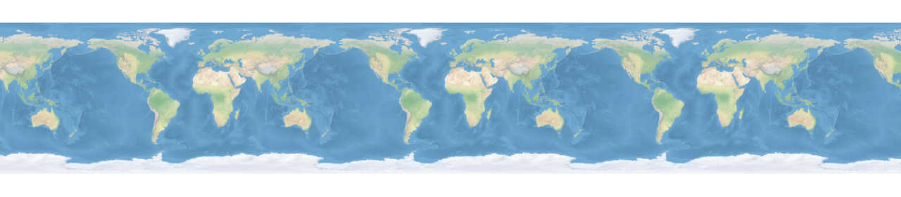
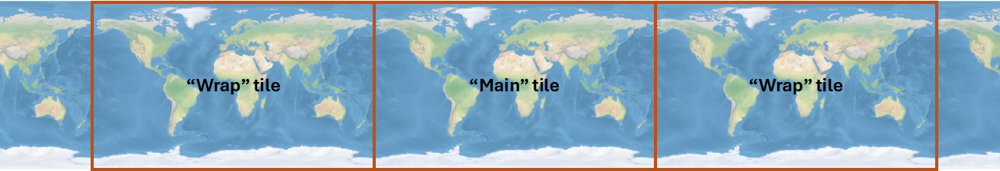

# Wrap-around Maps

* toc
{:toc}

Introduced in [MapLink Pro 11.2.1](../releases/11.2.1/release-notes).



Wrap-around maps provide the capability to pan the map continuously eastwards or westwards and display a seamless map across the International Dateline.

# How it Works
So that data layer draw orders are unaffected, the main wrapping code changes are implemented at the Data Layer. The data layer draws the “main tile”, followed by “wrap tiles” either side of the main tile:



When drawing a wrap tile, MapLink creates the draw extent for the wrap tile, along with a query extent which is the normalised equivalent of the draw extent. This means that the query extent will intersect the existing data model, allowing the correct data and features to be selected and drawn into the wrap tile.

# API
To enable wrap-around mode, all you need to do is tell the drawing surface to wrap longitudinally.

C++:
```
drawingSurface.wrapAroundMode(TSLDrawingSurface::WrapAroundLongitudinal);
```
.NET:
```
drawingSurface.wrapAroundMode(TSLN2DDrawingSurface.WrapAroundMode.WrapAroundLongitudinal);
```

Each data layer implements its own wrapping, so draw orders and all other layer functionality should work the same regardless of whether the drawing surface has wrap-around enabled or not.

## Custom Data Layers
If your application implements a [custom data layer](../../api/cpp/class_t_s_l_client_custom_data_layer.html), you will need to make a small change in order to support wrap-around mode. You will need to implement a new overload of drawLayer in both [TSLClientCustomDataLayer](../../api/cpp/class_t_s_l_client_custom_data_layer.html) and [TSLCustomDataLayerHandler](../../api/cpp/class_t_s_l_custom_data_layer_handler.html), that takes two envelope arguments:
- drawExtent: provides the extent of the area being drawn by the drawing surface in TMCs.
- queryExtent: Specifies the extent of the area being queried for features and data to draw.

queryExtent is the normalised equivalent of drawExtent, so queryExtent should always intersect with the data model even when drawing wrap tiles, while drawExtent might not.

So, to find features, raster tiles and data to display, use queryExtent to query your data model. Use drawExtent to draw the features. The core MapLink code will shift the features, tiles and data into the draw extent for you.

# Limitations
- Wrap-around mode is supported only when your drawing surface is using an appropriate coordinate system, e.g. WGS84, World Mercator or Dynamic Arc Grid.
- Wrap-around mode is not supported when using a Realtime Reprojection map. Realtime reprojection maps can provide similar functionality to wrap-around maps by moving the reference datum to a specified location, often the centre of the screen, so that the map re-projects around the location of interest even if the location is at the dateline.
- Wrap-around mode is not yet tested with rotated drawing surfaces.

# Considerations
 As maps are now being drawn the maps over a potentially larger area of the drawing surface when zoomed out, there is an increased potential for the maths used in TMC coordinates to overflow. When MapLink detects this, it stops drawing tiles so that your application will not crash which results in the map containing blank tiles temporarily.
 
 To mitigate this if you experience the issue, it is recommended to reduce the TMC Per Map Unit setting in MapLink Studio for each map you will use in wrap-around mode.


